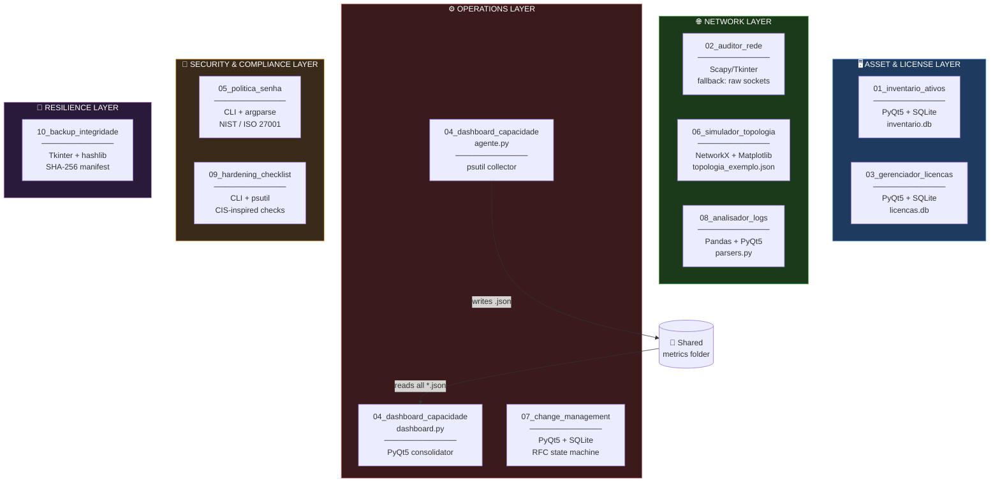
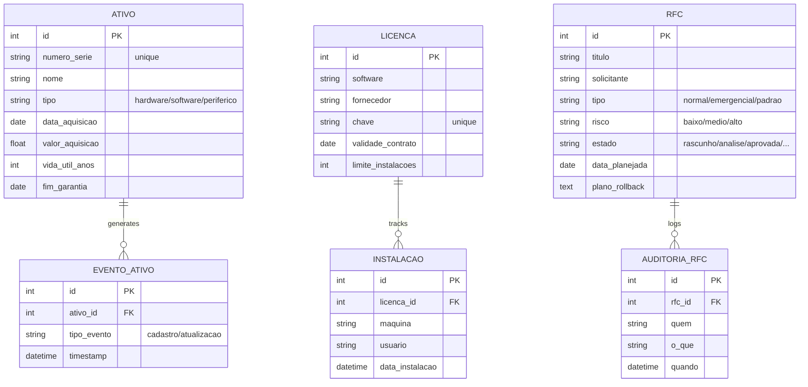
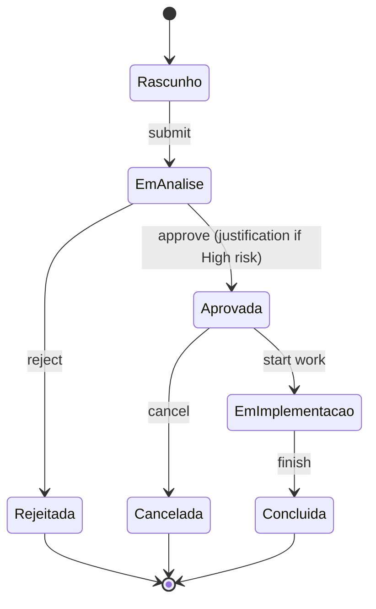
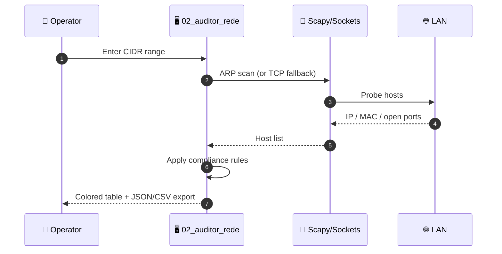
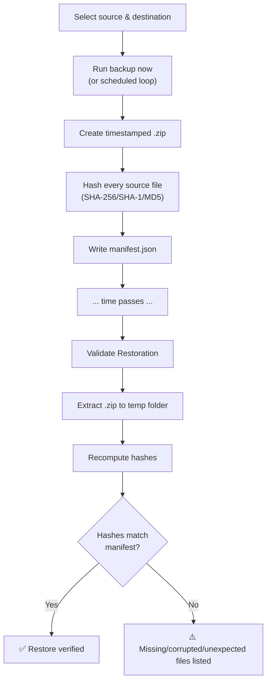
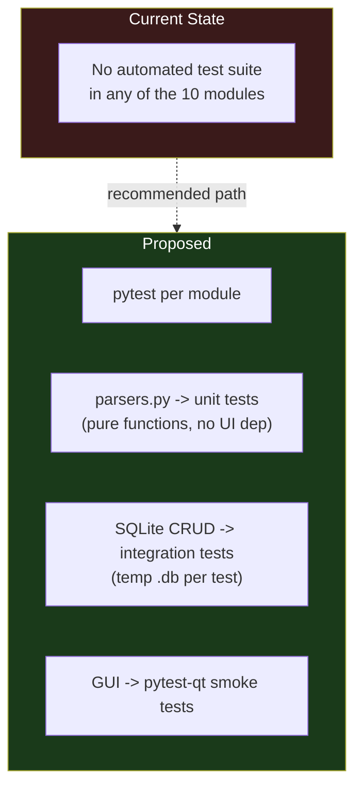

<div align="center">

**🌐 Choose Language / Selecione o Idioma / Elija el Idioma**

[](README.md)&nbsp;&nbsp;&nbsp;[](README_PT.md)&nbsp;&nbsp;&nbsp;[](README_ES.md)

</div>

---

<div align="center">

```
██╗███╗   ██╗███████╗██████╗  █████╗  ██████╗  ██████╗ ██╗   ██╗███████╗██████╗ ███╗   ██╗
██║████╗  ██║██╔════╝██╔══██╗██╔══██╗██╔════╝ ██╔═══██╗██║   ██║██╔════╝██╔══██╗████╗  ██║
██║██╔██╗ ██║█████╗  ██████╔╝███████║██║  ███╗██║   ██║██║   ██║█████╗  ██████╔╝██╔██╗ ██║
██║██║╚██╗██║██╔══╝  ██╔══██╗██╔══██║██║   ██║██║   ██║╚██╗ ██╔╝██╔══╝  ██╔══██╗██║╚██╗██║
██║██║ ╚████║██║     ██║  ██║██║  ██║╚██████╔╝╚██████╔╝ ╚████╔╝ ███████╗██║  ██║██║ ╚████║
╚═╝╚═╝  ╚═══╝╚═╝     ╚═╝  ╚═╝╚═╝  ╚═╝ ╚═════╝  ╚═════╝   ╚═══╝  ╚══════╝╚═╝  ╚═╝╚═╝  ╚═══╝
              10 Standalone Python Tools for Local IT & Infrastructure Governance
```

---

[](https://www.python.org/)
[](https://pypi.org/project/PyQt5/)
[](https://www.sqlite.org/)
[](https://pandas.pydata.org/)
[](https://networkx.org/)
[]()
[]()

<br/>

> **A monorepo of 10 independent, offline-first Python tools that together cover the daily**
> operational surface of local IT governance, from asset inventory to backup integrity.

<br/>


-41CD52?style=flat-square)

-10B981?style=flat-square)


</div>

---

## 📑 Table of Contents

<details>
<summary>▶️ <strong>Click to expand / collapse this section</strong></summary>

<table>
<tr>
<td valign="top" width="50%">

**🏗️ System**
- [Overview](#-overview)
- [System Architecture](#-system-architecture)
- [Technology Stack](#-technology-stack)
- [Design Patterns](#-design-patterns-applied)
- [Project Structure](#-project-structure)

**📦 Modules**
- [01 Asset Inventory](#01--offline-it-asset-inventory)
- [02 Network Auditor](#02--local-network-configuration-auditor)
- [03 License Manager](#03--software-license-manager)
- [04 Capacity Dashboard](#04--multi-machine-capacity-dashboard)
- [05 Password Policy Tool](#05--password-policy--compliance-generator)
- [06 Topology Simulator](#06--network-topology-simulator)
- [07 Change Management](#07--change-management-rfc-manager)
- [08 Log Analyzer](#08--firewallproxy-log-analyzer)
- [09 Hardening Checklist](#09--hardening-checklist-cis-benchmark)
- [10 Backup Integrity](#10--local-backup-with-integrity-verification)

</td>
<td valign="top" width="50%">

**💼 Business**
- [Business Rules](#-business-rules)
- [Functional Requirements](#-functional-requirements)
- [Non-Functional Requirements](#-non-functional-requirements)

**📐 Design**
- [Data Model](#-data-model)
- [System Flows](#-system-flows)

**🔐 Security & Ops**
- [Security](#-security)
- [Installation & Execution](#-installation--execution)
- [Automated Tests](#-automated-tests)
- [Metrics & Monitoring](#-metrics--monitoring)
- [Known Limitations](#-known-limitations)

</td>
</tr>
</table>

---

</details>

## 🌟 Overview

<details>
<summary>▶️ <strong>Click to expand / collapse this section</strong></summary>

**InfraGovernation** is a monorepo of **10 independent, self-contained Python applications**, each living in its own numbered folder with its own `app.py` (or equivalent entry point), its own `requirements.txt`, and its own `README.md`. There is no shared runtime, no shared package, and no orchestration layer between the tools: every folder can be copied out on its own and still work.

The suite covers the recurring operational needs of a small or mid-size IT department that does not run a full ITSM/CMDB platform: knowing what hardware and software exists, auditing the local network, tracking license compliance, watching disk/memory capacity across machines, enforcing password policy, modeling network resilience, running change control with an audit trail, triaging firewall logs, checking OS hardening against CIS-inspired controls, and verifying that backups can actually be restored.

Every tool that needs persistence uses a **local SQLite file** created automatically on first run, so nothing in the suite requires a database server, a message broker, or any other piece of shared infrastructure. Two tools (`05_politica_senha` and `10_backup_integridade`) use nothing but the Python standard library.

### 🎯 System Objectives

| Objective | Description |
|-----------|-------------|
| 🖥️ **Asset Visibility** | Maintain a searchable inventory of hardware/software with automatic linear depreciation |
| 🌐 **Network Compliance** | Discover LAN hosts and flag risky open ports (Telnet, FTP, exposed SMB/RDP) |
| 📜 **License Control** | Track license keys, contract validity and installation caps per software title |
| 📊 **Capacity Awareness** | Consolidate CPU/memory/disk telemetry from multiple machines into one dashboard |
| 🔑 **Password Compliance** | Validate password configuration against NIST 800-63B and ISO/IEC 27001 profiles |
| 🕸️ **Resilience Modeling** | Simulate node/link failures on a network topology and compute redundant paths |
| 📝 **Change Control** | Enforce an RFC state machine with an immutable audit trail |
| 🔎 **Log Triage** | Normalize Squid/pfSense/Windows Firewall logs and flag scan/brute-force patterns |
| 🛡️ **OS Hardening** | Run CIS-inspired checks on Windows or Linux with CI-friendly exit codes |
| 💾 **Backup Assurance** | Hash-verify that a compressed backup can be restored without corruption |

---

</details>

## 🏗️ System Architecture

<details>
<summary>▶️ <strong>Click to expand / collapse this section</strong></summary>

### Module Diagram



### Architecture Layers

```mermaid
flowchart LR
    subgraph L1["🖥️ Data Collection"]
        A1["psutil / Scapy / hashlib"]
        A2["File / registry / socket reads"]
    end
    subgraph L2["🧠 Business Logic"]
        B1["Compliance engines"]
        B2["State machines"]
    end
    subgraph L3["🗄️ Persistence"]
        C1["SQLite (5 modules)"]
        C2["JSON files (3 modules)"]
    end
    subgraph L4["🖼️ Presentation"]
        D1["PyQt5 / Tkinter GUI"]
        D2["argparse CLI"]
    end

    L1 --> L2 --> L3 --> L4

    style L1 fill:#1565C0,color:#fff
    style L2 fill:#2E7D32,color:#fff
    style L3 fill:#6A1B9A,color:#fff
    style L4 fill:#BF360C,color:#fff
```



---

</details>

## 🛠️ Technology Stack

<details>
<summary>▶️ <strong>Click to expand / collapse this section</strong></summary>

<table>
<tr><th>Layer</th><th>Technology</th><th>Version</th><th>Purpose</th></tr>
<tr><td rowspan="1">Language</td><td>Python</td><td>3.9+</td><td>Runtime for all 10 modules</td></tr>
<tr><td rowspan="4">GUI</td><td>PyQt5</td><td>&gt;=5.15</td><td>GUI for modules 01, 03, 04, 07, 08</td></tr>
<tr><td>Tkinter</td><td>stdlib</td><td>GUI for modules 02, 10</td></tr>
<tr><td>Matplotlib</td><td>&gt;=3.7</td><td>Interactive topology canvas in module 06</td></tr>
<tr><td>argparse</td><td>stdlib</td><td>CLI for modules 05, 09</td></tr>
<tr><td rowspan="2">Persistence</td><td>SQLite</td><td>stdlib (sqlite3)</td><td>Local DB for modules 01, 03, 04(via JSON), 07</td></tr>
<tr><td>JSON files</td><td>stdlib</td><td>Config/state for 04, 06, 09, 10</td></tr>
<tr><td rowspan="3">Data / Network</td><td>Pandas</td><td>&gt;=2.0</td><td>Log normalization in module 08</td></tr>
<tr><td>NetworkX</td><td>&gt;=3.0</td><td>Graph algorithms in module 06</td></tr>
<tr><td>Scapy</td><td>&gt;=2.5</td><td>ARP/host discovery in module 02 (optional)</td></tr>
<tr><td rowspan="1">System</td><td>psutil</td><td>&gt;=5.9</td><td>CPU/memory/disk telemetry in modules 04, 09</td></tr>
<tr><td rowspan="1">Standard Library</td><td>hashlib, zipfile, subprocess, re</td><td>stdlib</td><td>Hashing, archiving, OS checks, validation</td></tr>
</table>

---

</details>

## 🎨 Design Patterns Applied

<details>
<summary>▶️ <strong>Click to expand / collapse this section</strong></summary>

| Pattern | Where | Rationale |
|---------|-------|-----------|
| **Fallback Strategy** | `02_auditor_rede/app.py` | Falls back from Scapy ARP scan to raw TCP sockets when Npcap/admin rights are absent |
| **State Machine** | `07_change_management/app.py` (`TRANSICOES_PERMITIDAS`) | Enforces legal RFC transitions (Draft → Review → Approved → ...) |
| **Strategy** | `08_analisador_logs/parsers.py` | One parser strategy per log format (Squid, pfSense, Windows Firewall), all normalized to one schema |
| **Producer/Consumer via Filesystem** | `04_dashboard_capacidade` (`agente.py` / `dashboard.py`) | Agents write JSON snapshots; the dashboard consumes them without a network protocol |
| **Template Method** | `09_hardening_checklist/app.py` | Common check-and-report flow specialized per OS-detected control set |
| **Rule Engine** | `05_politica_senha/app.py`, `02_auditor_rede/app.py` | Declarative compliance rules evaluated against a config or a scan result |
| **Repository (implicit)** | `01_inventario_ativos`, `03_gerenciador_licencas`, `07_change_management` | SQLite access isolated behind CRUD functions, separate from the PyQt5 views |
| **Manifest/Checksum Verification** | `10_backup_integridade/app.py` | SHA-256/SHA-1/MD5 manifest generated at backup time, replayed at restore time |

---

</details>

## 📁 Project Structure

<details>
<summary>▶️ <strong>Click to expand / collapse this section</strong></summary>

```
InfraGovernation/
│
├── 📂 01_inventario_ativos/         # Offline IT asset inventory (PyQt5 + SQLite)
│   ├── 📄 app.py                    # GUI, CRUD, depreciation, alerts
│   ├── 📄 requirements.txt          # PyQt5>=5.15
│   └── 📄 README.md                 # Module-level docs (untouched)
│
├── 📂 02_auditor_rede/              # Local network compliance auditor (Scapy/Tkinter)
│   ├── 📄 app.py                    # Discovery, port scan, compliance rules
│   ├── 📄 requirements.txt          # scapy>=2.5
│   └── 📄 README.md
│
├── 📂 03_gerenciador_licencas/      # Software license manager (PyQt5 + SQLite)
│   ├── 📄 app.py                    # License CRUD, install caps, alerts
│   ├── 📄 requirements.txt          # PyQt5>=5.15
│   └── 📄 README.md
│
├── 📂 04_dashboard_capacidade/      # Multi-machine capacity dashboard (PyQt5 + psutil)
│   ├── 📄 agente.py                 # Per-station collector -> JSON snapshot
│   ├── 📄 dashboard.py              # Consolidating PyQt5 viewer
│   ├── 📂 metrics/                  # Default local snapshot folder
│   ├── 📄 requirements.txt          # PyQt5>=5.15, psutil>=5.9
│   └── 📄 README.md
│
├── 📂 05_politica_senha/            # Password policy & compliance CLI (stdlib only)
│   ├── 📄 app.py                    # gerar-exemplo / validar-config / validar-senha
│   ├── 📄 requirements.txt          # (no external deps)
│   └── 📄 README.md
│
├── 📂 06_simulador_topologia/       # Network topology simulator (NetworkX + Matplotlib)
│   ├── 📄 app.py                    # Interactive graph, failure sim, redundant paths
│   ├── 📄 requirements.txt          # networkx>=3.0, matplotlib>=3.7
│   └── 📄 README.md
│
├── 📂 07_change_management/         # Change management / RFC manager (PyQt5 + SQLite)
│   ├── 📄 app.py                    # RFC state machine, audit trail
│   ├── 📄 requirements.txt          # PyQt5>=5.15
│   └── 📄 README.md
│
├── 📂 08_analisador_logs/           # Firewall/proxy log analyzer (Pandas + PyQt5)
│   ├── 📄 app.py                    # GUI, correlation engine
│   ├── 📄 parsers.py                # Pure parsing logic per log format
│   ├── 📄 requirements.txt          # PyQt5>=5.15, pandas>=2.0
│   └── 📄 README.md
│
├── 📂 09_hardening_checklist/       # CIS-inspired hardening checklist (CLI + psutil)
│   ├── 📄 app.py                    # OS detection, control set, JSON report
│   ├── 📄 requirements.txt          # psutil>=5.9
│   └── 📄 README.md
│
├── 📂 10_backup_integridade/        # Local backup with integrity check (Tkinter + hashlib)
│   ├── 📄 app.py                    # Backup, manifest, scheduled loop, restore validation
│   ├── 📄 requirements.txt          # (no external deps)
│   └── 📄 README.md
│
├── 📄 README.md                     # This file (English, primary)
├── 📄 README_PT.md                  # Portuguese translation
└── 📄 README_ES.md                  # Spanish translation
```

---

</details>

## 📦 System Modules

<details>
<summary>▶️ <strong>Click to expand / collapse this section</strong></summary>

### 01 · Offline IT Asset Inventory

`01_inventario_ativos/app.py` (407 lines) is a PyQt5 desktop application backed by a local `inventario.db` SQLite file, created automatically on first run.

| Responsibility | Detail |
|---|---|
| Register/edit/delete assets | Hardware, software, peripherals, licenses, network gear |
| Uniqueness | Serial number is enforced unique to prevent duplicates |
| Depreciation | Automatic linear depreciation from acquisition value, date and useful life |
| Alerts tab | Assets with expired warranty or expiring within 30 days |
| History | Per-asset event log (registration, updates) |
| Search/filter | By text (name, serial, owner) and by status |
| Export | CSV |

---

### 02 · Local Network Configuration Auditor

`02_auditor_rede/app.py` (276 lines) scans the LAN, identifies hosts (IP/MAC/hostname) and open ports, and produces a compliance report.

| Responsibility | Detail |
|---|---|
| Host discovery | CIDR-scoped scan; Scapy ARP when Npcap + admin rights are available |
| Fallback mode | Automatic drop to plain TCP sockets when Scapy/privileges are unavailable |
| Port scan | Configurable list of common ports |
| Reverse DNS | Hostname resolution per discovered host |
| Compliance engine | Flags risky ports (Telnet, FTP, exposed SMB/RDP) and missing reverse DNS |
| UI | Tkinter table, green = compliant, red = non-compliant |
| Export | JSON and CSV |

---

### 03 · Software License Manager

`03_gerenciador_licencas/app.py` (390 lines) is a PyQt5 application backed by `licencas.db`, tracking license keys and installation caps.

| Responsibility | Detail |
|---|---|
| License registry | Software, vendor, unique key, type, contract, value |
| Install tracking | Per machine/user, auto-blocks once the contracted limit is reached |
| Alerts tab | Licenses expired/expiring within 30 days, or at install-cap |
| Search | By software, vendor or contract |
| Export | CSV |

---

### 04 · Multi-Machine Capacity Dashboard

Two-component architecture in `04_dashboard_capacidade/`: `agente.py` (91 lines) collects telemetry via `psutil` on each station and writes a `<hostname>.json` file to a shared folder; `dashboard.py` (159 lines) is a PyQt5 viewer that reads every JSON in that folder and consolidates it into one panel.

| Responsibility | Detail |
|---|---|
| Collection | CPU, memory, swap and per-partition disk usage |
| Consolidation | File-based multi-machine aggregation, no central database needed |
| Alerts | Disk >= 85% or memory >= 90% |
| Drill-down | Per-partition detail on click |
| Refresh | Auto every 30 seconds or manual button |
| Agent scheduling | `--intervalo 0` for a single collection run (e.g. via Windows Task Scheduler) |

---

### 05 · Password Policy & Compliance Generator

`05_politica_senha/app.py` (230 lines) is a stdlib-only CLI that validates password configuration against **NIST SP 800-63B** and **ISO/IEC 27001** reference profiles.

| Command | Purpose |
|---|---|
| `gerar-exemplo --saida <file>` | Generate a sample compliant configuration file |
| `validar-config <file> --perfil {nist,iso27001}` | Validate an exported config (e.g. from AD/GPO) |
| `validar-senha "<password>" --perfil <profile>` | Validate a single password |

Config keys checked: `tamanho_minimo`, `exige_maiuscula`, `exige_minuscula`, `exige_numero`, `exige_especial`, `expiracao_dias`, `bloqueia_reuso_ultimas`, `bloqueia_senhas_comuns`, `max_tentativas_login`.

---

### 06 · Network Topology Simulator

`06_simulador_topologia/app.py` (216 lines) draws a network topology (core/switch/server/WAN nodes) using NetworkX and Matplotlib, and simulates failures interactively.

| Responsibility | Detail |
|---|---|
| Rendering | Color-coded by node type |
| Failure simulation | Click a node or an edge midpoint to remove it from the active graph |
| Shortest path | Dijkstra/BFS via NetworkX between chosen source/destination |
| Redundant paths | Edge-disjoint path count (`edge_disjoint_paths`) under simulated failures |
| Persistence | Custom topologies loadable/savable as `networkx.node_link_data` JSON |
| Reset | Restores the original topology |

---

### 07 · Change Management (RFC) Manager

`07_change_management/app.py` (418 lines) is a PyQt5 application implementing an internal Request-for-Change workflow with an immutable audit trail.

```
Draft -> Under Review -> Approved -> In Implementation -> Completed
              |               |
              v               v
          Rejected        Cancelled
```

| Responsibility | Detail |
|---|---|
| RFC form | Title, requester, type (normal/emergency/standard), risk, affected systems, planned date, mandatory rollback plan |
| State machine | Only transitions defined in `TRANSICOES_PERMITIDAS` are allowed |
| High-risk gate | Approving High-risk changes requires a mandatory comment/justification |
| Edit restriction | Direct form edits allowed only while the RFC is in Draft |
| Deletion restriction | Deletion allowed only for Draft or Cancelled RFCs |
| Audit trail | Full who/when/what log per RFC, dedicated tab, never erased |
| Export | CSV |

---

### 08 · Firewall/Proxy Log Analyzer

`08_analisador_logs/` splits parsing (`parsers.py`, 145 lines) from the PyQt5 UI (`app.py`, 186 lines), importing logs from **Squid**, **pfSense** and **Windows Firewall**.

| Format | Detail |
|---|---|
| Squid `access.log` | `timestamp client_ip status/code bytes method url user ...` |
| pfSense `filterlog` (CSV) | `timestamp, action, proto, src, src_port, dst, dst_port` |
| Windows Firewall `pfirewall.log` (W3C) | `date time action protocol src-ip dst-ip src-port dst-port ...` |

| Tab | Detail |
|---|---|
| Events | Full navigable table, filter by source/destination and allow/deny |
| Anomalies Detected | 10+ denied connections from one source; 20+ distinct destinations from one source; 15+ distinct destination ports from one source |
| Statistical Summary | Totals, allowed vs. denied, unique sources/destinations |
| Export | Filtered events to CSV |

---

### 09 · Hardening Checklist (CIS Benchmark)

`09_hardening_checklist/app.py` (217 lines) is a CLI that runs an OS-hardening checklist inspired by CIS Benchmark controls, auto-detecting Windows or Linux.

| Scope | Controls |
|---|---|
| Cross-platform | No high-risk service (FTP/Telnet/SMB/RDP/VNC) listening on exposed ports; active session review; root/system volume disk usage below 90% |
| Windows | Windows Firewall active on all profiles; minimum password length >= 8 (`net accounts`); SMBv1 disabled; WinRM service state (informational) |
| Linux | SSH `PermitRootLogin no`; `PASS_MAX_DAYS` <= 90 in `/etc/login.defs`; firewall (`firewalld`/`ufw`) enabled |

Exit code: `0` = 100% compliant, `1` = at least one gap found, making it usable in CI/schedulers. `--saida relatorio.json` writes a JSON report.

---

### 10 · Local Backup with Integrity Verification

`10_backup_integridade/app.py` (323 lines) is a stdlib-only Tkinter application that schedules local backups, hashes every file, and validates restorability.

| Responsibility | Detail |
|---|---|
| Backup | Source folder compressed into a timestamped `.zip` at the destination |
| Manifest | `_hashes/<file>.zip.manifest.json` with SHA-256/SHA-1/MD5 of every original file |
| Scheduling | Background loop every N minutes (thread + sleep, no external deps) |
| Restore validation | Extracts the `.zip` to a temp folder, recomputes hashes, compares against the manifest, flags missing/corrupted/unexpected files |
| Logging | Real-time operation log in the UI |
| Config persistence | Source/destination folders saved to `backup_config.json` |

---

</details>

## 💼 Business Rules

<details>
<summary>▶️ <strong>Click to expand / collapse this section</strong></summary>

### Asset & License Governance

| # | Rule | Enforcement |
|---|------|-------------|
| BR-01 | An asset's serial number must be unique across the inventory | `01_inventario_ativos` insert validation against `inventario.db` |
| BR-02 | Depreciation is calculated linearly from acquisition value, date and useful life | `01_inventario_ativos` depreciation function |
| BR-03 | A license cannot be installed beyond its contracted install count | `03_gerenciador_licencas` install-count gate |
| BR-04 | License keys must be unique | `03_gerenciador_licencas` insert validation |

### Change & Network Governance

| # | Rule | Enforcement |
|---|------|-------------|
| BR-05 | An RFC may only move between states defined in the transition table | `07_change_management` `TRANSICOES_PERMITIDAS` |
| BR-06 | Approving a High-risk RFC requires a non-empty justification comment | `07_change_management` approval validation |
| BR-07 | An RFC can be deleted only while Draft or Cancelled | `07_change_management` delete guard |
| BR-08 | A host exposing Telnet, FTP, unauthenticated SMB or RDP is flagged non-compliant | `02_auditor_rede` compliance rule engine |

### Capacity & Backup Governance

| # | Rule | Enforcement |
|---|------|-------------|
| BR-09 | A machine is flagged when disk usage >= 85% or memory usage >= 90% | `04_dashboard_capacidade/dashboard.py` alert thresholds |
| BR-10 | A restored backup is only considered valid if every file's recomputed hash matches its manifest entry | `10_backup_integridade` restore validation |

---

</details>

## ✅ Functional Requirements

<details>
<summary>▶️ <strong>Click to expand / collapse this section</strong></summary>

| ID | Requirement | Priority | Status |
|----|-------------|----------|--------|
| RF-01 | Register, edit and delete IT assets with depreciation | 🔴 High | ✅ Implemented |
| RF-02 | Alert on expired/expiring asset warranty | 🟡 Medium | ✅ Implemented |
| RF-03 | Export asset inventory to CSV | 🟢 Low | ✅ Implemented |
| RF-04 | Discover LAN hosts by CIDR range | 🔴 High | ✅ Implemented |
| RF-05 | Scan configurable port list per host | 🔴 High | ✅ Implemented |
| RF-06 | Fall back to socket-based discovery without admin rights | 🟡 Medium | ✅ Implemented |
| RF-07 | Register software licenses with contract and value | 🔴 High | ✅ Implemented |
| RF-08 | Block installs beyond contracted license count | 🔴 High | ✅ Implemented |
| RF-09 | Collect CPU/memory/disk telemetry per station | 🔴 High | ✅ Implemented |
| RF-10 | Consolidate multi-machine telemetry into one dashboard | 🔴 High | ✅ Implemented |
| RF-11 | Validate password config against NIST/ISO profiles | 🔴 High | ✅ Implemented |
| RF-12 | Validate a single password string against a profile | 🟡 Medium | ✅ Implemented |
| RF-13 | Simulate node/link failure on a topology | 🟡 Medium | ✅ Implemented |
| RF-14 | Compute shortest and redundant paths | 🟡 Medium | ✅ Implemented |
| RF-15 | Enforce RFC state machine transitions | 🔴 High | ✅ Implemented |
| RF-16 | Maintain an immutable audit trail per RFC | 🔴 High | ✅ Implemented |
| RF-17 | Parse Squid/pfSense/Windows Firewall logs into one schema | 🔴 High | ✅ Implemented |
| RF-18 | Detect scan/brute-force patterns in normalized logs | 🟡 Medium | ✅ Implemented |
| RF-19 | Run OS-aware hardening checks with a report | 🔴 High | ✅ Implemented |
| RF-20 | Return CI-friendly exit codes from hardening checks | 🟡 Medium | ✅ Implemented |
| RF-21 | Compress and hash-manifest a backup | 🔴 High | ✅ Implemented |
| RF-22 | Validate backup restorability against the manifest | 🔴 High | ✅ Implemented |
| RF-23 | Schedule recurring backups without external dependencies | 🟡 Medium | ✅ Implemented |
| RF-24 | Central log console for backup operations | 🟢 Low | ✅ Implemented |
| RF-25 | Persist source/destination folder config between runs | 🟢 Low | ✅ Implemented |

---

</details>

## ⚡ Non-Functional Requirements

<details>
<summary>▶️ <strong>Click to expand / collapse this section</strong></summary>

| ID | Category | Requirement | Target |
|----|----------|-------------|--------|
| RNF-01 | ⚡ Performance | Local SQLite operations respond without perceptible UI lag | < 200ms per query |
| RNF-02 | 🔌 Portability | Every module runs from its own folder with only its own `requirements.txt` | Zero shared code |
| RNF-03 | 🖥️ Cross-Platform | Modules 09 detect OS and adapt controls automatically | Windows + Linux |
| RNF-04 | 🔐 Least Privilege | Network audit degrades gracefully without admin/Npcap | Functional fallback |
| RNF-05 | 💾 Data Durability | SQLite files are created and persisted locally, never in-memory | Survive process restart |
| RNF-06 | 📦 Dependency Footprint | Two modules (05, 10) require zero third-party packages | stdlib-only |
| RNF-07 | 🧩 Modularity | Each tool is independently deployable and removable | No cross-imports |
| RNF-08 | ♻️ Auditability | Change management history is never deleted, even on RFC removal | Immutable log rows |
| RNF-09 | 🖼️ Usability | GUI tools provide color-coded status feedback | Green/red visual cues |
| RNF-10 | 🧪 Testability | Parsing logic is separated from UI where feasible | `parsers.py` isolation |
| RNF-11 | 🔁 Automatability | Hardening checklist returns standard process exit codes | CI/scheduler compatible |
| RNF-12 | 📁 Simplicity of Ops | No project requires a running database server | SQLite/JSON only |
| RNF-13 | 🌐 Network Tolerance | Capacity dashboard works with a local folder in place of a network share | Same code path |

---

</details>

## 🗄️ Data Model

<details>
<summary>▶️ <strong>Click to expand / collapse this section</strong></summary>

### Entity-Relationship Diagram

Each SQLite-backed module owns its own schema; there is no shared database. The diagram below models the union of the persisted entities across modules 01, 03 and 07.



### Non-Relational State (JSON/file-based modules)

| Module | Storage | Shape |
|---|---|---|
| `04_dashboard_capacidade` | `<hostname>.json` per station | `{cpu, memoria, swap, discos: [{particao, uso_pct}], timestamp}` |
| `06_simulador_topologia` | `topologia_exemplo.json` | `networkx.node_link_data` graph (nodes with `tipo`, edges) |
| `09_hardening_checklist` | `relatorio.json` (optional) | `{checks: [{nome, status, recomendacao}], conforme_pct}` |
| `10_backup_integridade` | `_hashes/<file>.zip.manifest.json`, `backup_config.json` | `{arquivo: sha256}` manifest; `{origem, destino, intervalo}` config |

---

</details>

## 🔄 System Flows

<details>
<summary>▶️ <strong>Click to expand / collapse this section</strong></summary>

### RFC Approval Flow



### Network Audit Sequence



### Backup & Restore Validation



---

</details>

## 🔐 Security

<details>
<summary>▶️ <strong>Click to expand / collapse this section</strong></summary>

### Implemented Controls

| Control | Implementation | Effect |
|---|---|---|
| Least-privilege network scanning | `02_auditor_rede` fallback mode | Works without admin/Npcap, just less precise |
| Password policy validation | `05_politica_senha` NIST/ISO engines | Flags weak length, reuse, complexity, expiration settings |
| Immutable audit trail | `07_change_management` `AUDITORIA_RFC` | No delete path exposed for audit rows |
| High-risk approval gate | `07_change_management` | Requires justification comment before approval |
| OS hardening checks | `09_hardening_checklist` | Flags Telnet/FTP/SMBv1/exposed RDP, weak SSH root login |
| Backup integrity verification | `10_backup_integridade` | Detects silent corruption via hash comparison |
| Local-only data | All modules | No data leaves the machine except explicit CSV/JSON exports |

### Known Security Limitations

> [!WARNING]
> These tools are educational/operational aids, not a hardened security product. Review the limitations below before relying on them for compliance evidence.

| Limitation | Risk | Mitigation Path |
|---|---|---|
| SQLite files are unencrypted on disk | Local data exposure if the machine is compromised | Add OS-level disk encryption (BitLocker/LUKS) |
| No authentication/authorization layer in any GUI | Any local user can view/edit all records | Wrap with OS-level file permissions or add an auth layer |
| `02_auditor_rede` fallback scan is less accurate | False negatives on host/port discovery | Prefer the Scapy+Npcap path when possible |
| Hardening checklist controls are a subset of full CIS Benchmark | Partial compliance coverage only | Treat as a first pass, pair with a full CIS scan |
| No network transport encryption for `04_dashboard_capacidade` shared folder | Snapshot JSON readable by anyone with share access | Restrict share ACLs to authorized machines |
| Password validator only checks configuration/format, not breach databases | Common-but-technically-valid passwords may pass | Pair with a breached-password check (e.g. HIBP API) |

---

</details>

## 🚀 Installation & Execution

<details>
<summary>▶️ <strong>Click to expand / collapse this section</strong></summary>

### Prerequisites

```bash
# Python 3.9 or newer, per-module virtual environment recommended
python --version
```

### Build

There is no build step; each module is pure Python. Install only what a given module needs:

```bash
# Example: module 01 (Asset Inventory)
cd 01_inventario_ativos
pip install -r requirements.txt
```

### Execution

```bash
# Generic pattern for every module
cd <module_folder>
pip install -r requirements.txt
python app.py            # or the entry point named in that module's README

# Module 04 needs both processes:
python agente.py --pasta "\\server\share\metrics" --intervalo 60
python dashboard.py

# Module 05 and 09 are CLIs:
python app.py gerar-exemplo --saida config_exemplo.json
python app.py --saida relatorio.json
```

### Scripts & Targets

| Module | Entry Point | Special Flags |
|---|---|---|
| 01 | `app.py` | none |
| 02 | `app.py` | requires Npcap on Windows for full accuracy |
| 03 | `app.py` | none |
| 04 | `agente.py`, `dashboard.py` | `--pasta`, `--intervalo` |
| 05 | `app.py` | `gerar-exemplo`, `validar-config`, `validar-senha` |
| 06 | `app.py` | optional `<topologia.json>` argument |
| 07 | `app.py` | none |
| 08 | `app.py` | none |
| 09 | `app.py` | `--saida relatorio.json` |
| 10 | `app.py` | none |

### Build/Runtime Configuration

| Setting | Where | Purpose |
|---|---|---|
| `PyQt5>=5.15` | requirements.txt of 01/03/04/07/08 | GUI toolkit pin |
| `scapy>=2.5` | requirements.txt of 02 | ARP scanning; optional at runtime |
| `pandas>=2.0` | requirements.txt of 08 | Log dataframe processing |
| `networkx>=3.0`, `matplotlib>=3.7` | requirements.txt of 06 | Graph modeling and rendering |
| `psutil>=5.9` | requirements.txt of 04, 09 | System telemetry |

---

</details>

## 🧪 Automated Tests

<details>
<summary>▶️ <strong>Click to expand / collapse this section</strong></summary>

### Test Architecture



None of the 10 modules currently ships an automated test file. This is a real gap, stated plainly rather than hidden.

### Running the Tests

```bash
# No test suite exists yet. To validate a module manually:
cd 08_analisador_logs
python -c "from parsers import parse_squid; print(parse_squid('access.log'))"
```

### Manual Acceptance Checklist

| # | Check | Module | Expected Result |
|---|---|---|---|
| 1 | Register an asset with a duplicate serial | 01 | Rejected with an error |
| 2 | Scan `127.0.0.0/30` without admin rights | 02 | Falls back to socket mode, still returns results |
| 3 | Install a license beyond its cap | 03 | Blocked |
| 4 | Point agent and dashboard at the same local folder | 04 | Dashboard shows the collected snapshot |
| 5 | Validate a 6-character password against NIST | 05 | Reported non-compliant |
| 6 | Click a node in the topology view | 06 | Node removed, path recalculated |
| 7 | Approve a High-risk RFC without a comment | 07 | Blocked with validation message |
| 8 | Import a Squid and a pfSense log together | 08 | Both normalized into one events table |
| 9 | Run the checklist on a hardened vs. default machine | 09 | Different compliance percentages, exit codes 0 vs 1 |
| 10 | Corrupt one file inside a restored backup | 10 | Flagged as hash mismatch |

---

</details>

## 📊 Metrics & Monitoring

<details>
<summary>▶️ <strong>Click to expand / collapse this section</strong></summary>

### Codebase Metrics

| Module | Entry file(s) | Lines |
|---|---|---|
| 01 | app.py | 407 |
| 02 | app.py | 276 |
| 03 | app.py | 390 |
| 04 | agente.py + dashboard.py | 91 + 159 |
| 05 | app.py | 230 |
| 06 | app.py | 216 |
| 07 | app.py | 418 |
| 08 | app.py + parsers.py | 186 + 145 |
| 09 | app.py | 217 |
| 10 | app.py | 323 |
| **Total** | | **~3,058** |

### Runtime Signals

| Signal | Source | Meaning |
|---|---|---|
| SQLite file size | `inventario.db`, `licencas.db`, RFC DB | Grows with records; back up alongside the app |
| `<hostname>.json` freshness | `04_dashboard_capacidade` shared folder | Stale timestamp implies an agent stopped collecting |
| `relatorio.json` `conforme_pct` | `09_hardening_checklist` | Trend this over time per machine |
| Backup manifest count | `10_backup_integridade/_hashes/` | One manifest expected per successful backup run |

### Diagnostic Commands

```bash
# Count lines per module quickly
wc -l 01_inventario_ativos/app.py 02_auditor_rede/app.py 03_gerenciador_licencas/app.py

# Inspect a SQLite file without a GUI
sqlite3 01_inventario_ativos/inventario.db ".tables"

# Check hardening exit code in a script
python 09_hardening_checklist/app.py; echo "exit=$?"
```

### Exit / Status Codes

| Code | Module | Meaning |
|---|---|---|
| 0 | 09_hardening_checklist | 100% of applicable controls pass |
| 1 | 09_hardening_checklist | At least one control gap found |
| N/A | GUI modules (01, 02, 03, 04, 07, 08, 10) | No process exit code contract; errors surfaced via dialogs |

---

</details>

## ⚠️ Known Limitations

<details>
<summary>▶️ <strong>Click to expand / collapse this section</strong></summary>

> [!IMPORTANT]
> These are independent educational/operational tools, not an integrated ITSM suite. Treat each module's limitations separately.

| Category | Issue | Status |
|---|---|---|
| Testing | No automated test suite exists in any module | ⚠️ Open |
| Integration | Modules share no database, API or common config | ➕ Intentional |
| Concurrency | SQLite modules assume single-writer local usage | ⚠️ Open |
| Security | No authentication layer on any GUI tool | ⚠️ Open |
| Accuracy | `02_auditor_rede` fallback mode is less precise than the Scapy path | ⚠️ Open |
| Coverage | `09_hardening_checklist` implements a subset, not the full CIS Benchmark | ⚠️ Open |
| Networking | `04_dashboard_capacidade` requires a manually configured shared folder | ➕ Intentional |
| Scale | Not designed for fleets beyond a small/mid IT department | ➕ Intentional |
| Persistence | No cross-module reporting or unified dashboard | ⚠️ Open |
| Compatibility | GUI modules require a desktop session (no headless mode) | ⚠️ Open |

> [!TIP]
> The single highest-value improvement would be adding a `pytest` suite starting with `08_analisador_logs/parsers.py`, since its parsing functions are already pure and UI-independent, making them the cheapest to cover first.

---

</details>

---

<div align="center">

---

### 🏛️ InfraGovernation

*Ten small tools, one governed infrastructure.*


<br/>

```
"Governance is not a platform you buy. It is the sum of the small checks
 you run before something breaks."
```

</div>
