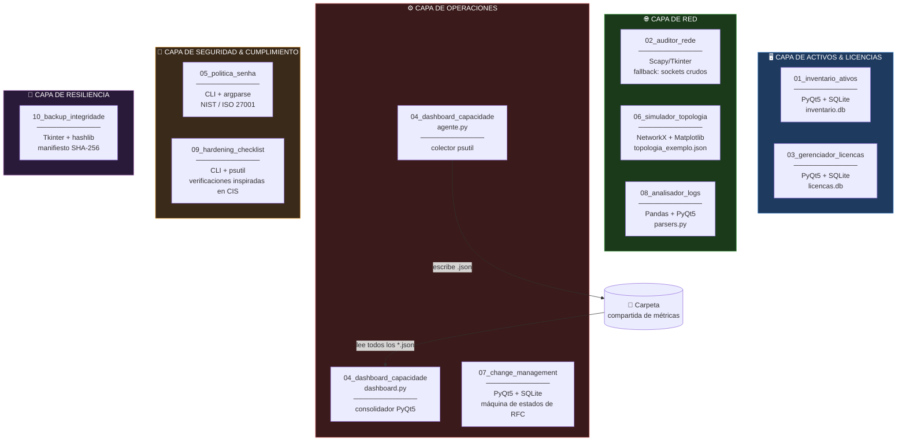
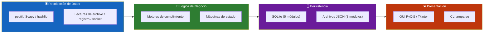
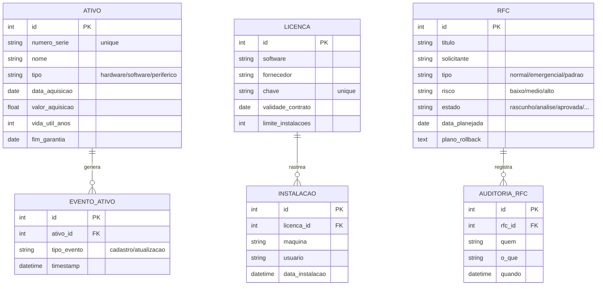
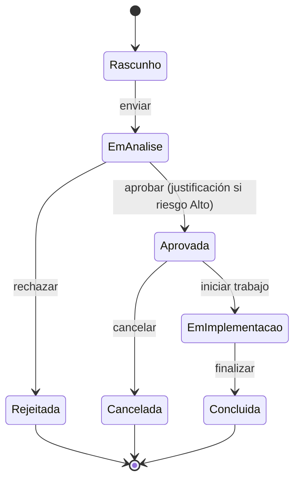
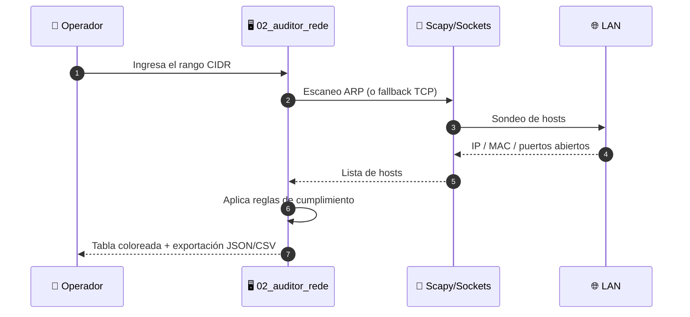
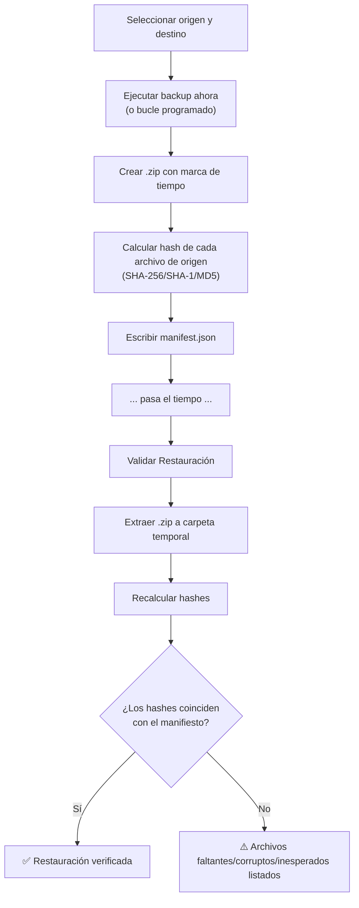
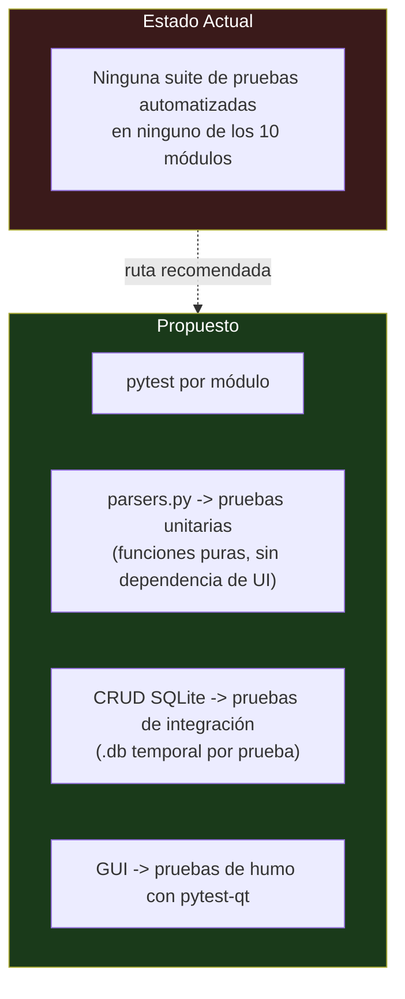

<div align="center">

**🌐 Choose Language / Selecione o Idioma / Elija el Idioma**

[](README.md)&nbsp;&nbsp;&nbsp;[](README_PT.md)&nbsp;&nbsp;&nbsp;[](README_ES.md)

</div>

---

<div align="center">

```
██╗███╗   ██╗███████╗██████╗  █████╗  ██████╗  ██████╗ ██╗   ██╗███████╗██████╗ ███╗   ██╗
██║████╗  ██║██╔════╝██╔══██╗██╔══██╗██╔════╝ ██╔═══██╗██║   ██║██╔════╝██╔══██╗████╗  ██║
██║██╔██╗ ██║█████╗  ██████╔╝███████║██║  ███╗██║   ██║██║   ██║█████╗  ██████╔╝██╔██╗ ██║
██║██║╚██╗██║██╔══╝  ██╔══██╗██╔══██║██║   ██║██║   ██║╚██╗ ██╔╝██╔══╝  ██╔══██╗██║╚██╗██║
██║██║ ╚████║██║     ██║  ██║██║  ██║╚██████╔╝╚██████╔╝ ╚████╔╝ ███████╗██║  ██║██║ ╚████║
╚═╝╚═╝  ╚═══╝╚═╝     ╚═╝  ╚═╝╚═╝  ╚═╝ ╚═════╝  ╚═════╝   ╚═══╝  ╚══════╝╚═╝  ╚═╝╚═╝  ╚═══╝
              10 Herramientas Python Independientes para la Gobernanza Local de TI e Infraestructura
```

---

[](https://www.python.org/)
[](https://pypi.org/project/PyQt5/)
[](https://www.sqlite.org/)
[](https://pandas.pydata.org/)
[](https://networkx.org/)
[]()
[]()

<br/>

> **Un monorepo con 10 herramientas Python independientes y offline-first que en conjunto cubren la superficie**
> operativa diaria de la gobernanza local de TI, desde el inventario de activos hasta la integridad de los backups.

<br/>


-41CD52?style=flat-square)

-10B981?style=flat-square)


</div>

---

## 📑 Tabla de Contenidos

<details>
<summary>▶️ <strong>Haga clic para expandir / contraer esta sección</strong></summary>

<table>
<tr>
<td valign="top" width="50%">

**🏗️ Sistema**
- [Visión General](#-visión-general)
- [Arquitectura del Sistema](#-arquitectura-del-sistema)
- [Stack Tecnológico](#-stack-tecnológico)
- [Patrones de Diseño](#-patrones-de-diseño-aplicados)
- [Estructura del Proyecto](#-estructura-del-proyecto)

**📦 Módulos**
- [01 Inventario de Activos](#01--inventario-offline-de-activos-de-ti)
- [02 Auditor de Red](#02--auditor-de-configuración-de-red-local)
- [03 Gestor de Licencias](#03--gestor-de-licencias-de-software)
- [04 Panel de Capacidad](#04--panel-de-capacidad-multi-máquina)
- [05 Política de Contraseñas](#05--generador-de-política-y-cumplimiento-de-contraseñas)
- [06 Simulador de Topología](#06--simulador-de-topología-de-red)
- [07 Gestión de Cambios](#07--gestor-de-cambios-rfc)
- [08 Analizador de Logs](#08--analizador-de-logs-de-firewallproxy)
- [09 Checklist de Hardening](#09--checklist-de-hardening-cis-benchmark)
- [10 Integridad de Backup](#10--backup-local-con-verificación-de-integridad)

</td>
<td valign="top" width="50%">

**💼 Negocio**
- [Reglas de Negocio](#-reglas-de-negocio)
- [Requisitos Funcionales](#-requisitos-funcionales)
- [Requisitos No Funcionales](#-requisitos-no-funcionales)

**📐 Diseño**
- [Modelo de Datos](#-modelo-de-datos)
- [Flujos del Sistema](#-flujos-del-sistema)

**🔐 Seguridad & Operaciones**
- [Seguridad](#-seguridad)
- [Instalación & Ejecución](#-instalación--ejecución)
- [Pruebas Automatizadas](#-pruebas-automatizadas)
- [Métricas & Monitoreo](#-métricas--monitoreo)
- [Limitaciones Conocidas](#-limitaciones-conocidas)

</td>
</tr>
</table>

---

</details>

## 🌟 Visión General

<details>
<summary>▶️ <strong>Haga clic para expandir / contraer esta sección</strong></summary>

**InfraGovernation** es un monorepo con **10 aplicaciones Python independientes y autocontenidas**, cada una alojada en su propia carpeta numerada, con su propio `app.py` (o punto de entrada equivalente), su propio `requirements.txt` y su propio `README.md`. No hay runtime compartido, ningún paquete compartido ni una capa de orquestación entre las herramientas: cualquier carpeta puede copiarse de forma aislada y seguir funcionando.

El conjunto cubre las necesidades operativas recurrentes de un departamento de TI pequeño o mediano que no opera una plataforma completa de ITSM/CMDB: saber qué hardware y software existe, auditar la red local, dar seguimiento al cumplimiento de licencias, vigilar la capacidad de disco/memoria entre máquinas, aplicar la política de contraseñas, modelar la resiliencia de la red, ejecutar el control de cambios con un rastro de auditoría, triar logs de firewall, verificar el hardening del sistema operativo contra controles inspirados en CIS y verificar que los backups realmente puedan restaurarse.

Toda herramienta que necesita persistencia usa un **archivo SQLite local** creado automáticamente en la primera ejecución, por lo que nada en el conjunto requiere un servidor de base de datos, un broker de mensajes ni ninguna otra pieza de infraestructura compartida. Dos herramientas (`05_politica_senha` y `10_backup_integridade`) no usan más que la biblioteca estándar de Python.

### 🎯 Objetivos del Sistema

| Objetivo | Descripción |
|-----------|-------------|
| 🖥️ **Visibilidad de Activos** | Mantener un inventario buscable de hardware/software con depreciación lineal automática |
| 🌐 **Cumplimiento de Red** | Descubrir hosts de la LAN y señalar puertos abiertos riesgosos (Telnet, FTP, SMB/RDP expuestos) |
| 📜 **Control de Licencias** | Rastrear claves de licencia, vigencia de contrato y límites de instalación por título de software |
| 📊 **Conciencia de Capacidad** | Consolidar la telemetría de CPU/memoria/disco de múltiples máquinas en un solo panel |
| 🔑 **Cumplimiento de Contraseñas** | Validar la configuración de contraseñas contra los perfiles NIST 800-63B e ISO/IEC 27001 |
| 🕸️ **Modelado de Resiliencia** | Simular fallas de nodo/enlace en una topología de red y calcular rutas redundantes |
| 📝 **Control de Cambios** | Aplicar una máquina de estados de RFC con un rastro de auditoría inmutable |
| 🔎 **Triaje de Logs** | Normalizar logs de Squid/pfSense/Firewall de Windows y señalar patrones de escaneo/fuerza bruta |
| 🛡️ **Hardening de SO** | Ejecutar verificaciones inspiradas en CIS en Windows o Linux con códigos de salida aptos para CI |
| 💾 **Garantía de Backup** | Verificar mediante hash que un backup comprimido pueda restaurarse sin corrupción |

---

</details>

## 🏗️ Arquitectura del Sistema

<details>
<summary>▶️ <strong>Haga clic para expandir / contraer esta sección</strong></summary>

### Diagrama de Módulos



### Capas de la Arquitectura



---

</details>

## 🛠️ Stack Tecnológico

<details>
<summary>▶️ <strong>Haga clic para expandir / contraer esta sección</strong></summary>

<table>
<tr><th>Capa</th><th>Tecnología</th><th>Versión</th><th>Propósito</th></tr>
<tr><td rowspan="1">Lenguaje</td><td>Python</td><td>3.9+</td><td>Runtime de los 10 módulos</td></tr>
<tr><td rowspan="4">GUI</td><td>PyQt5</td><td>&gt;=5.15</td><td>GUI de los módulos 01, 03, 04, 07, 08</td></tr>
<tr><td>Tkinter</td><td>stdlib</td><td>GUI de los módulos 02, 10</td></tr>
<tr><td>Matplotlib</td><td>&gt;=3.7</td><td>Lienzo interactivo de topología en el módulo 06</td></tr>
<tr><td>argparse</td><td>stdlib</td><td>CLI de los módulos 05, 09</td></tr>
<tr><td rowspan="2">Persistencia</td><td>SQLite</td><td>stdlib (sqlite3)</td><td>BD local de los módulos 01, 03, 04 (vía JSON), 07</td></tr>
<tr><td>Archivos JSON</td><td>stdlib</td><td>Config/estado de los módulos 04, 06, 09, 10</td></tr>
<tr><td rowspan="3">Datos / Red</td><td>Pandas</td><td>&gt;=2.0</td><td>Normalización de logs en el módulo 08</td></tr>
<tr><td>NetworkX</td><td>&gt;=3.0</td><td>Algoritmos de grafos en el módulo 06</td></tr>
<tr><td>Scapy</td><td>&gt;=2.5</td><td>Descubrimiento de hosts vía ARP en el módulo 02 (opcional)</td></tr>
<tr><td rowspan="1">Sistema</td><td>psutil</td><td>&gt;=5.9</td><td>Telemetría de CPU/memoria/disco en los módulos 04, 09</td></tr>
<tr><td rowspan="1">Biblioteca Estándar</td><td>hashlib, zipfile, subprocess, re</td><td>stdlib</td><td>Hashing, empaquetado, verificaciones de SO, validación</td></tr>
</table>

---

</details>

## 🎨 Patrones de Diseño Aplicados

<details>
<summary>▶️ <strong>Haga clic para expandir / contraer esta sección</strong></summary>

| Patrón | Dónde | Justificación |
|---------|-------|-----------|
| **Estrategia de Fallback** | `02_auditor_rede/app.py` | Retrocede del escaneo ARP con Scapy a sockets TCP crudos cuando faltan Npcap/privilegios de administrador |
| **Máquina de Estados** | `07_change_management/app.py` (`TRANSICOES_PERMITIDAS`) | Aplica las transiciones legales de RFC (Borrador → En Análisis → Aprobada → ...) |
| **Strategy** | `08_analisador_logs/parsers.py` | Una estrategia de parser por formato de log (Squid, pfSense, Firewall de Windows), todos normalizados a un mismo esquema |
| **Productor/Consumidor vía Sistema de Archivos** | `04_dashboard_capacidade` (`agente.py` / `dashboard.py`) | Los agentes escriben snapshots JSON; el panel los consume sin un protocolo de red |
| **Template Method** | `09_hardening_checklist/app.py` | Flujo común de verificación-e-informe especializado según el conjunto de controles detectado por SO |
| **Motor de Reglas** | `05_politica_senha/app.py`, `02_auditor_rede/app.py` | Reglas de cumplimiento declarativas evaluadas contra una configuración o un resultado de escaneo |
| **Repository (implícito)** | `01_inventario_ativos`, `03_gerenciador_licencas`, `07_change_management` | Acceso a SQLite aislado detrás de funciones CRUD, separado de las vistas PyQt5 |
| **Verificación de Manifiesto/Checksum** | `10_backup_integridade/app.py` | Manifiesto SHA-256/SHA-1/MD5 generado en el momento del backup, reproducido al restaurar |

---

</details>

## 📁 Estructura del Proyecto

<details>
<summary>▶️ <strong>Haga clic para expandir / contraer esta sección</strong></summary>

```
InfraGovernation/
│
├── 📂 01_inventario_ativos/         # Inventario offline de activos de TI (PyQt5 + SQLite)
│   ├── 📄 app.py                    # GUI, CRUD, depreciación, alertas
│   ├── 📄 requirements.txt          # PyQt5>=5.15
│   └── 📄 README.md                 # Documentación del módulo (sin modificar)
│
├── 📂 02_auditor_rede/              # Auditor de cumplimiento de red local (Scapy/Tkinter)
│   ├── 📄 app.py                    # Descubrimiento, escaneo de puertos, reglas de cumplimiento
│   ├── 📄 requirements.txt          # scapy>=2.5
│   └── 📄 README.md
│
├── 📂 03_gerenciador_licencas/      # Gestor de licencias de software (PyQt5 + SQLite)
│   ├── 📄 app.py                    # CRUD de licencias, límites de instalación, alertas
│   ├── 📄 requirements.txt          # PyQt5>=5.15
│   └── 📄 README.md
│
├── 📂 04_dashboard_capacidade/      # Panel de capacidad multi-máquina (PyQt5 + psutil)
│   ├── 📄 agente.py                 # Colector por estación -> snapshot JSON
│   ├── 📄 dashboard.py              # Visor consolidador PyQt5
│   ├── 📂 metrics/                  # Carpeta predeterminada de snapshots locales
│   ├── 📄 requirements.txt          # PyQt5>=5.15, psutil>=5.9
│   └── 📄 README.md
│
├── 📂 05_politica_senha/            # CLI de política y cumplimiento de contraseñas (solo stdlib)
│   ├── 📄 app.py                    # gerar-exemplo / validar-config / validar-senha
│   ├── 📄 requirements.txt          # (sin dependencias externas)
│   └── 📄 README.md
│
├── 📂 06_simulador_topologia/       # Simulador de topología de red (NetworkX + Matplotlib)
│   ├── 📄 app.py                    # Grafo interactivo, simulación de fallas, rutas redundantes
│   ├── 📄 requirements.txt          # networkx>=3.0, matplotlib>=3.7
│   └── 📄 README.md
│
├── 📂 07_change_management/         # Gestor de cambios / RFC (PyQt5 + SQLite)
│   ├── 📄 app.py                    # Máquina de estados de RFC, rastro de auditoría
│   ├── 📄 requirements.txt          # PyQt5>=5.15
│   └── 📄 README.md
│
├── 📂 08_analisador_logs/           # Analizador de logs de firewall/proxy (Pandas + PyQt5)
│   ├── 📄 app.py                    # GUI, motor de correlación
│   ├── 📄 parsers.py                # Lógica de parsing pura por formato de log
│   ├── 📄 requirements.txt          # PyQt5>=5.15, pandas>=2.0
│   └── 📄 README.md
│
├── 📂 09_hardening_checklist/       # Checklist de hardening inspirado en CIS (CLI + psutil)
│   ├── 📄 app.py                    # Detección de SO, conjunto de controles, informe JSON
│   ├── 📄 requirements.txt          # psutil>=5.9
│   └── 📄 README.md
│
├── 📂 10_backup_integridade/        # Backup local con verificación de integridad (Tkinter + hashlib)
│   ├── 📄 app.py                    # Backup, manifiesto, bucle programado, validación de restauración
│   ├── 📄 requirements.txt          # (sin dependencias externas)
│   └── 📄 README.md
│
├── 📄 README.md                     # Este archivo (inglés, principal)
├── 📄 README_PT.md                  # Traducción al portugués
└── 📄 README_ES.md                  # Traducción al español
```

---

</details>

## 📦 Módulos del Sistema

<details>
<summary>▶️ <strong>Haga clic para expandir / contraer esta sección</strong></summary>

### 01 · Inventario Offline de Activos de TI

`01_inventario_ativos/app.py` (407 líneas) es una aplicación de escritorio PyQt5 respaldada por un archivo SQLite local `inventario.db`, creado automáticamente en la primera ejecución.

| Responsabilidad | Detalle |
|---|---|
| Registrar/editar/eliminar activos | Hardware, software, periféricos, licencias, equipo de red |
| Unicidad | El número de serie se exige único para evitar duplicados |
| Depreciación | Depreciación lineal automática a partir del valor de adquisición, fecha y vida útil |
| Pestaña de alertas | Activos con garantía vencida o por vencer en 30 días |
| Historial | Registro de eventos por activo (registro, actualizaciones) |
| Búsqueda/filtro | Por texto (nombre, serie, responsable) y por estado |
| Exportación | CSV |

---

### 02 · Auditor de Configuración de Red Local

`02_auditor_rede/app.py` (276 líneas) escanea la LAN, identifica hosts (IP/MAC/hostname) y puertos abiertos, y produce un informe de cumplimiento.

| Responsabilidad | Detalle |
|---|---|
| Descubrimiento de hosts | Escaneo por rango CIDR; ARP con Scapy cuando Npcap + privilegios de administrador están disponibles |
| Modo de fallback | Retroceso automático a sockets TCP simples cuando Scapy/privilegios no están disponibles |
| Escaneo de puertos | Lista configurable de puertos comunes |
| DNS inverso | Resolución de hostname por host descubierto |
| Motor de cumplimiento | Señala puertos riesgosos (Telnet, FTP, SMB/RDP expuestos) y ausencia de DNS inverso |
| UI | Tabla Tkinter, verde = conforme, rojo = no conforme |
| Exportación | JSON y CSV |

---

### 03 · Gestor de Licencias de Software

`03_gerenciador_licencas/app.py` (390 líneas) es una aplicación PyQt5 respaldada por `licencas.db`, que rastrea claves de licencia y límites de instalación.

| Responsabilidad | Detalle |
|---|---|
| Registro de licencias | Software, proveedor, clave única, tipo, contrato, valor |
| Seguimiento de instalaciones | Por máquina/usuario, bloquea automáticamente al alcanzar el límite contratado |
| Pestaña de alertas | Licencias vencidas/por vencer en 30 días, o en el límite de instalaciones |
| Búsqueda | Por software, proveedor o contrato |
| Exportación | CSV |

---

### 04 · Panel de Capacidad Multi-Máquina

Arquitectura de dos componentes en `04_dashboard_capacidade/`: `agente.py` (91 líneas) recolecta telemetría vía `psutil` en cada estación y escribe un archivo `<hostname>.json` en una carpeta compartida; `dashboard.py` (159 líneas) es un visor PyQt5 que lee todos los JSON de esa carpeta y los consolida en un solo panel.

| Responsabilidad | Detalle |
|---|---|
| Recolección | CPU, memoria, swap y uso de disco por partición |
| Consolidación | Agregación multi-máquina basada en archivos, sin necesidad de base de datos central |
| Alertas | Disco >= 85% o memoria >= 90% |
| Detalle | Detalle por partición al hacer clic |
| Actualización | Automática cada 30 segundos o botón manual |
| Programación del agente | `--intervalo 0` para una única ejecución de recolección (ej. vía Programador de Tareas de Windows) |

---

### 05 · Generador de Política y Cumplimiento de Contraseñas

`05_politica_senha/app.py` (230 líneas) es una CLI que usa solo la biblioteca estándar y valida la configuración de contraseñas contra los perfiles de referencia **NIST SP 800-63B** e **ISO/IEC 27001**.

| Comando | Propósito |
|---|---|
| `gerar-exemplo --saida <archivo>` | Genera un archivo de configuración de ejemplo conforme |
| `validar-config <archivo> --perfil {nist,iso27001}` | Valida una configuración exportada (ej. de AD/GPO) |
| `validar-senha "<contraseña>" --perfil <perfil>` | Valida una sola contraseña |

Claves de configuración verificadas: `tamanho_minimo`, `exige_maiuscula`, `exige_minuscula`, `exige_numero`, `exige_especial`, `expiracao_dias`, `bloqueia_reuso_ultimas`, `bloqueia_senhas_comuns`, `max_tentativas_login`.

---

### 06 · Simulador de Topología de Red

`06_simulador_topologia/app.py` (216 líneas) dibuja una topología de red (nodos core/switch/servidor/WAN) usando NetworkX y Matplotlib, y simula fallas de forma interactiva.

| Responsabilidad | Detalle |
|---|---|
| Renderizado | Codificado por color según el tipo de nodo |
| Simulación de fallas | Clic en un nodo o en el punto medio de un enlace para eliminarlo del grafo activo |
| Ruta más corta | Dijkstra/BFS vía NetworkX entre origen/destino elegidos |
| Rutas redundantes | Conteo de rutas disjuntas por arista (`edge_disjoint_paths`) bajo fallas simuladas |
| Persistencia | Topologías personalizadas cargables/guardables como JSON `networkx.node_link_data` |
| Reinicio | Restaura la topología original |

---

### 07 · Gestor de Cambios (RFC)

`07_change_management/app.py` (418 líneas) es una aplicación PyQt5 que implementa un flujo interno de Request-for-Change con un rastro de auditoría inmutable.

```
Borrador -> En Análisis -> Aprobada -> En Implementación -> Completada
              |               |
              v               v
          Rechazada        Cancelada
```

| Responsabilidad | Detalle |
|---|---|
| Formulario de RFC | Título, solicitante, tipo (normal/emergencia/estándar), riesgo, sistemas afectados, fecha planificada, plan de rollback obligatorio |
| Máquina de estados | Solo se permiten las transiciones definidas en `TRANSICOES_PERMITIDAS` |
| Bloqueo de alto riesgo | Aprobar cambios de riesgo Alto requiere un comentario/justificación obligatoria |
| Restricción de edición | Edición directa del formulario permitida solo mientras la RFC está en Borrador |
| Restricción de eliminación | Eliminación permitida solo para RFC en Borrador o Canceladas |
| Rastro de auditoría | Registro completo de quién/cuándo/qué por RFC, pestaña dedicada, nunca borrado |
| Exportación | CSV |

---

### 08 · Analizador de Logs de Firewall/Proxy

`08_analisador_logs/` separa el parsing (`parsers.py`, 145 líneas) de la UI PyQt5 (`app.py`, 186 líneas), importando logs de **Squid**, **pfSense** y **Firewall de Windows**.

| Formato | Detalle |
|---|---|
| Squid `access.log` | `timestamp client_ip status/code bytes method url user ...` |
| pfSense `filterlog` (CSV) | `timestamp, action, proto, src, src_port, dst, dst_port` |
| Firewall de Windows `pfirewall.log` (W3C) | `date time action protocol src-ip dst-ip src-port dst-port ...` |

| Pestaña | Detalle |
|---|---|
| Eventos | Tabla navegable completa, filtro por origen/destino y permitir/denegar |
| Anomalías Detectadas | 10+ conexiones denegadas de un origen; 20+ destinos distintos de un origen; 15+ puertos de destino distintos de un origen |
| Resumen Estadístico | Totales, permitidas vs. denegadas, orígenes/destinos únicos |
| Exportación | Eventos filtrados a CSV |

---

### 09 · Checklist de Hardening (CIS Benchmark)

`09_hardening_checklist/app.py` (217 líneas) es una CLI que ejecuta un checklist de hardening de SO inspirado en los controles del CIS Benchmark, detectando automáticamente Windows o Linux.

| Alcance | Controles |
|---|---|
| Multiplataforma | Ningún servicio de alto riesgo (FTP/Telnet/SMB/RDP/VNC) escuchando en puertos expuestos; revisión de sesiones activas; uso de disco del volumen raíz/sistema por debajo del 90% |
| Windows | Firewall de Windows activo en todos los perfiles; longitud mínima de contraseña >= 8 (`net accounts`); SMBv1 deshabilitado; estado del servicio WinRM (informativo) |
| Linux | SSH `PermitRootLogin no`; `PASS_MAX_DAYS` <= 90 en `/etc/login.defs`; firewall (`firewalld`/`ufw`) habilitado |

Código de salida: `0` = 100% conforme, `1` = al menos una brecha encontrada, lo que lo hace utilizable en CI/programadores. `--saida relatorio.json` escribe un informe JSON.

---

### 10 · Backup Local con Verificación de Integridad

`10_backup_integridade/app.py` (323 líneas) es una aplicación Tkinter que usa solo la biblioteca estándar, programa backups locales, calcula el hash de cada archivo y valida la restaurabilidad.

| Responsabilidad | Detalle |
|---|---|
| Backup | Carpeta de origen comprimida en un `.zip` con marca de tiempo en el destino |
| Manifiesto | `_hashes/<archivo>.zip.manifest.json` con SHA-256/SHA-1/MD5 de cada archivo original |
| Programación | Bucle en segundo plano cada N minutos (hilo + sleep, sin dependencias externas) |
| Validación de restauración | Extrae el `.zip` a una carpeta temporal, recalcula los hashes, los compara con el manifiesto, señala archivos faltantes/corruptos/inesperados |
| Registro | Log de operaciones en tiempo real en la UI |
| Persistencia de configuración | Carpetas de origen/destino guardadas en `backup_config.json` |

---

</details>

## 💼 Reglas de Negocio

<details>
<summary>▶️ <strong>Haga clic para expandir / contraer esta sección</strong></summary>

### Gobernanza de Activos & Licencias

| # | Regla | Aplicación |
|---|------|-------------|
| RN-01 | El número de serie de un activo debe ser único en todo el inventario | Validación de inserción en `01_inventario_ativos` contra `inventario.db` |
| RN-02 | La depreciación se calcula de forma lineal a partir del valor de adquisición, fecha y vida útil | Función de depreciación en `01_inventario_ativos` |
| RN-03 | Una licencia no puede instalarse más allá del número de instalaciones contratado | Bloqueo por conteo de instalaciones en `03_gerenciador_licencas` |
| RN-04 | Las claves de licencia deben ser únicas | Validación de inserción en `03_gerenciador_licencas` |

### Gobernanza de Cambios & Red

| # | Regla | Aplicación |
|---|------|-------------|
| RN-05 | Una RFC solo puede transitar entre los estados definidos en la tabla de transiciones | `TRANSICOES_PERMITIDAS` en `07_change_management` |
| RN-06 | Aprobar una RFC de riesgo Alto requiere un comentario de justificación no vacío | Validación de aprobación en `07_change_management` |
| RN-07 | Una RFC solo puede eliminarse mientras está en Borrador o Cancelada | Guardia de eliminación en `07_change_management` |
| RN-08 | Un host que expone Telnet, FTP, SMB no autenticado o RDP se marca como no conforme | Motor de reglas de cumplimiento en `02_auditor_rede` |

### Gobernanza de Capacidad & Backup

| # | Regla | Aplicación |
|---|------|-------------|
| RN-09 | Una máquina se marca cuando el uso de disco >= 85% o el uso de memoria >= 90% | Umbrales de alerta en `04_dashboard_capacidade/dashboard.py` |
| RN-10 | Un backup restaurado solo se considera válido si el hash recalculado de cada archivo coincide con su entrada en el manifiesto | Validación de restauración en `10_backup_integridade` |

---

</details>

## ✅ Requisitos Funcionales

<details>
<summary>▶️ <strong>Haga clic para expandir / contraer esta sección</strong></summary>

| ID | Requisito | Prioridad | Estado |
|----|-------------|----------|--------|
| RF-01 | Registrar, editar y eliminar activos de TI con depreciación | 🔴 Alta | ✅ Implementado |
| RF-02 | Alertar sobre garantía de activo vencida/por vencer | 🟡 Media | ✅ Implementado |
| RF-03 | Exportar inventario de activos a CSV | 🟢 Baja | ✅ Implementado |
| RF-04 | Descubrir hosts de la LAN por rango CIDR | 🔴 Alta | ✅ Implementado |
| RF-05 | Escanear lista configurable de puertos por host | 🔴 Alta | ✅ Implementado |
| RF-06 | Retroceder a descubrimiento basado en socket sin privilegios de administrador | 🟡 Media | ✅ Implementado |
| RF-07 | Registrar licencias de software con contrato y valor | 🔴 Alta | ✅ Implementado |
| RF-08 | Bloquear instalaciones más allá del número de licencias contratado | 🔴 Alta | ✅ Implementado |
| RF-09 | Recolectar telemetría de CPU/memoria/disco por estación | 🔴 Alta | ✅ Implementado |
| RF-10 | Consolidar telemetría multi-máquina en un solo panel | 🔴 Alta | ✅ Implementado |
| RF-11 | Validar configuración de contraseña contra perfiles NIST/ISO | 🔴 Alta | ✅ Implementado |
| RF-12 | Validar una sola contraseña contra un perfil | 🟡 Media | ✅ Implementado |
| RF-13 | Simular falla de nodo/enlace en una topología | 🟡 Media | ✅ Implementado |
| RF-14 | Calcular rutas más cortas y redundantes | 🟡 Media | ✅ Implementado |
| RF-15 | Aplicar las transiciones de la máquina de estados de RFC | 🔴 Alta | ✅ Implementado |
| RF-16 | Mantener un rastro de auditoría inmutable por RFC | 🔴 Alta | ✅ Implementado |
| RF-17 | Analizar logs de Squid/pfSense/Firewall de Windows en un solo esquema | 🔴 Alta | ✅ Implementado |
| RF-18 | Detectar patrones de escaneo/fuerza bruta en logs normalizados | 🟡 Media | ✅ Implementado |
| RF-19 | Ejecutar verificaciones de hardening según el SO con un informe | 🔴 Alta | ✅ Implementado |
| RF-20 | Devolver códigos de salida aptos para CI desde las verificaciones de hardening | 🟡 Media | ✅ Implementado |
| RF-21 | Comprimir y generar manifiesto de hash de un backup | 🔴 Alta | ✅ Implementado |
| RF-22 | Validar la restaurabilidad del backup contra el manifiesto | 🔴 Alta | ✅ Implementado |
| RF-23 | Programar backups recurrentes sin dependencias externas | 🟡 Media | ✅ Implementado |
| RF-24 | Consola central de log para operaciones de backup | 🟢 Baja | ✅ Implementado |
| RF-25 | Persistir configuración de carpetas de origen/destino entre ejecuciones | 🟢 Baja | ✅ Implementado |

---

</details>

## ⚡ Requisitos No Funcionales

<details>
<summary>▶️ <strong>Haga clic para expandir / contraer esta sección</strong></summary>

| ID | Categoría | Requisito | Objetivo |
|----|----------|-------------|--------|
| RNF-01 | ⚡ Rendimiento | Las operaciones locales en SQLite responden sin retraso perceptible en la UI | < 200ms por consulta |
| RNF-02 | 🔌 Portabilidad | Cada módulo se ejecuta desde su propia carpeta solo con su propio `requirements.txt` | Sin código compartido |
| RNF-03 | 🖥️ Multiplataforma | El módulo 09 detecta el SO y adapta los controles automáticamente | Windows + Linux |
| RNF-04 | 🔐 Mínimo Privilegio | La auditoría de red se degrada de forma controlada sin admin/Npcap | Fallback funcional |
| RNF-05 | 💾 Durabilidad de Datos | Los archivos SQLite se crean y persisten localmente, nunca en memoria | Sobrevive al reinicio del proceso |
| RNF-06 | 📦 Huella de Dependencias | Dos módulos (05, 10) no requieren paquetes de terceros | Solo stdlib |
| RNF-07 | 🧩 Modularidad | Cada herramienta es desplegable y removible de forma independiente | Sin imports cruzados |
| RNF-08 | ♻️ Auditabilidad | El historial de gestión de cambios nunca se elimina, incluso al remover una RFC | Filas de log inmutables |
| RNF-09 | 🖼️ Usabilidad | Las herramientas con GUI ofrecen retroalimentación de estado codificada por color | Señales visuales verde/rojo |
| RNF-10 | 🧪 Capacidad de Prueba | La lógica de parsing está separada de la UI cuando es viable | Aislamiento de `parsers.py` |
| RNF-11 | 🔁 Automatización | El checklist de hardening devuelve códigos de salida de proceso estándar | Compatible con CI/programadores |
| RNF-12 | 📁 Simplicidad Operativa | Ningún proyecto requiere un servidor de base de datos en ejecución | Solo SQLite/JSON |
| RNF-13 | 🌐 Tolerancia de Red | El panel de capacidad funciona con una carpeta local en lugar de un recurso compartido de red | Misma ruta de código |

---

</details>

## 🗄️ Modelo de Datos

<details>
<summary>▶️ <strong>Haga clic para expandir / contraer esta sección</strong></summary>

### Diagrama Entidad-Relación

Cada módulo respaldado por SQLite posee su propio esquema; no hay una base de datos compartida. El diagrama a continuación modela la unión de las entidades persistidas entre los módulos 01, 03 y 07.



### Estado No Relacional (módulos basados en JSON/archivo)

| Módulo | Almacenamiento | Formato |
|---|---|---|
| `04_dashboard_capacidade` | `<hostname>.json` por estación | `{cpu, memoria, swap, discos: [{particao, uso_pct}], timestamp}` |
| `06_simulador_topologia` | `topologia_exemplo.json` | Grafo `networkx.node_link_data` (nodos con `tipo`, aristas) |
| `09_hardening_checklist` | `relatorio.json` (opcional) | `{checks: [{nome, status, recomendacao}], conforme_pct}` |
| `10_backup_integridade` | `_hashes/<archivo>.zip.manifest.json`, `backup_config.json` | Manifiesto `{arquivo: sha256}`; configuración `{origem, destino, intervalo}` |

---

</details>

## 🔄 Flujos del Sistema

<details>
<summary>▶️ <strong>Haga clic para expandir / contraer esta sección</strong></summary>

### Flujo de Aprobación de RFC



### Secuencia de Auditoría de Red



### Validación de Backup & Restauración



---

</details>

## 🔐 Seguridad

<details>
<summary>▶️ <strong>Haga clic para expandir / contraer esta sección</strong></summary>

### Controles Implementados

| Control | Implementación | Efecto |
|---|---|---|
| Escaneo de red con mínimo privilegio | Modo de fallback de `02_auditor_rede` | Funciona sin admin/Npcap, solo con menor precisión |
| Validación de política de contraseñas | Motores NIST/ISO de `05_politica_senha` | Señala longitud débil, reutilización, complejidad, configuraciones de expiración |
| Rastro de auditoría inmutable | `AUDITORIA_RFC` en `07_change_management` | Ninguna ruta de eliminación expuesta para las filas de auditoría |
| Bloqueo de aprobación de alto riesgo | `07_change_management` | Requiere comentario de justificación antes de la aprobación |
| Verificaciones de hardening de SO | `09_hardening_checklist` | Señala Telnet/FTP/SMBv1/RDP expuesto, inicio de sesión root débil vía SSH |
| Verificación de integridad de backup | `10_backup_integridade` | Detecta corrupción silenciosa mediante comparación de hash |
| Datos solo locales | Todos los módulos | Ningún dato sale de la máquina excepto las exportaciones explícitas en CSV/JSON |

### Limitaciones de Seguridad Conocidas

> [!WARNING]
> Estas herramientas son ayudas educativas/operativas, no un producto de seguridad reforzado. Revise las limitaciones a continuación antes de utilizarlas como evidencia de cumplimiento.

| Limitación | Riesgo | Ruta de Mitigación |
|---|---|---|
| Los archivos SQLite no están cifrados en disco | Exposición de datos locales si la máquina se ve comprometida | Agregar cifrado de disco a nivel de SO (BitLocker/LUKS) |
| Ninguna capa de autenticación/autorización en ninguna GUI | Cualquier usuario local puede ver/editar todos los registros | Envolver con permisos de archivo del SO o agregar una capa de autenticación |
| El escaneo de fallback de `02_auditor_rede` es menos preciso | Falsos negativos en el descubrimiento de hosts/puertos | Preferir la ruta Scapy+Npcap cuando sea posible |
| Los controles del checklist de hardening son un subconjunto del CIS Benchmark completo | Cobertura de cumplimiento solo parcial | Tratar como una primera pasada, combinar con un escaneo CIS completo |
| Sin cifrado de transporte de red para la carpeta compartida de `04_dashboard_capacidade` | JSON de snapshot legible por cualquiera con acceso al recurso compartido | Restringir las ACL del recurso compartido a las máquinas autorizadas |
| El validador de contraseñas solo verifica configuración/formato, no bases de datos de filtraciones | Contraseñas comunes pero técnicamente válidas pueden pasar | Combinar con una verificación de contraseña filtrada (ej. API HIBP) |

---

</details>

## 🚀 Instalación & Ejecución

<details>
<summary>▶️ <strong>Haga clic para expandir / contraer esta sección</strong></summary>

### Requisitos Previos

```bash
# Python 3.9 o más reciente, se recomienda un entorno virtual por módulo
python --version
```

### Compilación

No hay paso de compilación; cada módulo es Python puro. Instale solo lo que necesite un módulo dado:

```bash
# Ejemplo: módulo 01 (Inventario de Activos)
cd 01_inventario_ativos
pip install -r requirements.txt
```

### Ejecución

```bash
# Patrón genérico para cada módulo
cd <carpeta_del_módulo>
pip install -r requirements.txt
python app.py            # o el punto de entrada nombrado en el README de ese módulo

# El módulo 04 necesita ambos procesos:
python agente.py --pasta "\\servidor\recurso_compartido\metrics" --intervalo 60
python dashboard.py

# Los módulos 05 y 09 son CLIs:
python app.py gerar-exemplo --saida config_exemplo.json
python app.py --saida relatorio.json
```

### Scripts & Objetivos

| Módulo | Punto de Entrada | Flags Especiales |
|---|---|---|
| 01 | `app.py` | ninguna |
| 02 | `app.py` | requiere Npcap en Windows para precisión total |
| 03 | `app.py` | ninguna |
| 04 | `agente.py`, `dashboard.py` | `--pasta`, `--intervalo` |
| 05 | `app.py` | `gerar-exemplo`, `validar-config`, `validar-senha` |
| 06 | `app.py` | argumento opcional `<topologia.json>` |
| 07 | `app.py` | ninguna |
| 08 | `app.py` | ninguna |
| 09 | `app.py` | `--saida relatorio.json` |
| 10 | `app.py` | ninguna |

### Configuración de Compilación/Runtime

| Configuración | Dónde | Propósito |
|---|---|---|
| `PyQt5>=5.15` | requirements.txt de 01/03/04/07/08 | Fijación del toolkit de GUI |
| `scapy>=2.5` | requirements.txt de 02 | Escaneo ARP; opcional en runtime |
| `pandas>=2.0` | requirements.txt de 08 | Procesamiento de dataframe de logs |
| `networkx>=3.0`, `matplotlib>=3.7` | requirements.txt de 06 | Modelado y renderizado de grafos |
| `psutil>=5.9` | requirements.txt de 04, 09 | Telemetría del sistema |

---

</details>

## 🧪 Pruebas Automatizadas

<details>
<summary>▶️ <strong>Haga clic para expandir / contraer esta sección</strong></summary>

### Arquitectura de Pruebas



Ninguno de los 10 módulos incluye actualmente un archivo de prueba automatizado. Esta es una brecha real, declarada abiertamente en lugar de ocultarse.

### Ejecutando las Pruebas

```bash
# Aún no existe una suite de pruebas. Para validar un módulo manualmente:
cd 08_analisador_logs
python -c "from parsers import parse_squid; print(parse_squid('access.log'))"
```

### Lista de Verificación Manual de Aceptación

| # | Verificación | Módulo | Resultado Esperado |
|---|---|---|---|
| 1 | Registrar un activo con número de serie duplicado | 01 | Rechazado con un error |
| 2 | Escanear `127.0.0.0/30` sin privilegios de administrador | 02 | Retrocede al modo socket, aún devuelve resultados |
| 3 | Instalar una licencia más allá de su límite | 03 | Bloqueado |
| 4 | Apuntar el agente y el panel a la misma carpeta local | 04 | El panel muestra el snapshot recolectado |
| 5 | Validar una contraseña de 6 caracteres contra el NIST | 05 | Reportada como no conforme |
| 6 | Hacer clic en un nodo en la vista de topología | 06 | Nodo eliminado, ruta recalculada |
| 7 | Aprobar una RFC de riesgo Alto sin comentario | 07 | Bloqueado con mensaje de validación |
| 8 | Importar un log de Squid y uno de pfSense juntos | 08 | Ambos normalizados en una sola tabla de eventos |
| 9 | Ejecutar el checklist en una máquina reforzada vs. predeterminada | 09 | Porcentajes de cumplimiento diferentes, códigos de salida 0 vs 1 |
| 10 | Corromper un archivo dentro de un backup restaurado | 10 | Marcado como discrepancia de hash |

---

</details>

## 📊 Métricas & Monitoreo

<details>
<summary>▶️ <strong>Haga clic para expandir / contraer esta sección</strong></summary>

### Métricas del Código

| Módulo | Archivo(s) de entrada | Líneas |
|---|---|---|
| 01 | app.py | 407 |
| 02 | app.py | 276 |
| 03 | app.py | 390 |
| 04 | agente.py + dashboard.py | 91 + 159 |
| 05 | app.py | 230 |
| 06 | app.py | 216 |
| 07 | app.py | 418 |
| 08 | app.py + parsers.py | 186 + 145 |
| 09 | app.py | 217 |
| 10 | app.py | 323 |
| **Total** | | **~3.058** |

### Señales de Runtime

| Señal | Fuente | Significado |
|---|---|---|
| Tamaño del archivo SQLite | `inventario.db`, `licencas.db`, BD de RFC | Crece con los registros; incluir en el backup junto con la aplicación |
| Actualidad del `<hostname>.json` | Carpeta compartida de `04_dashboard_capacidade` | Una marca de tiempo desactualizada indica que un agente dejó de recolectar |
| `conforme_pct` del `relatorio.json` | `09_hardening_checklist` | Seguir la tendencia en el tiempo por máquina |
| Conteo de manifiestos de backup | `10_backup_integridade/_hashes/` | Se espera un manifiesto por cada ejecución de backup exitosa |

### Comandos de Diagnóstico

```bash
# Contar líneas por módulo rápidamente
wc -l 01_inventario_ativos/app.py 02_auditor_rede/app.py 03_gerenciador_licencas/app.py

# Inspeccionar un archivo SQLite sin GUI
sqlite3 01_inventario_ativos/inventario.db ".tables"

# Verificar el código de salida del hardening en un script
python 09_hardening_checklist/app.py; echo "exit=$?"
```

### Códigos de Salida / Estado

| Código | Módulo | Significado |
|---|---|---|
| 0 | 09_hardening_checklist | 100% de los controles aplicables aprueban |
| 1 | 09_hardening_checklist | Al menos una brecha de control encontrada |
| N/A | Módulos con GUI (01, 02, 03, 04, 07, 08, 10) | Ningún contrato de código de salida de proceso; los errores se muestran mediante diálogos |

---

</details>

## ⚠️ Limitaciones Conocidas

<details>
<summary>▶️ <strong>Haga clic para expandir / contraer esta sección</strong></summary>

> [!IMPORTANT]
> Estas son herramientas educativas/operativas independientes, no una suite ITSM integrada. Trate las limitaciones de cada módulo por separado.

| Categoría | Problema | Estado |
|---|---|---|
| Pruebas | No existe una suite de pruebas automatizadas en ningún módulo | ⚠️ Abierto |
| Integración | Los módulos no comparten base de datos, API ni configuración común | ➕ Intencional |
| Concurrencia | Los módulos SQLite asumen uso local con un único escritor | ⚠️ Abierto |
| Seguridad | Ninguna capa de autenticación en ninguna herramienta con GUI | ⚠️ Abierto |
| Precisión | El modo de fallback de `02_auditor_rede` es menos preciso que la ruta con Scapy | ⚠️ Abierto |
| Cobertura | El `09_hardening_checklist` implementa un subconjunto, no el CIS Benchmark completo | ⚠️ Abierto |
| Red | El `04_dashboard_capacidade` requiere una carpeta compartida configurada manualmente | ➕ Intencional |
| Escala | No diseñado para flotas más allá de un departamento de TI pequeño/mediano | ➕ Intencional |
| Persistencia | Ningún informe entre módulos ni panel unificado | ⚠️ Abierto |
| Compatibilidad | Los módulos con GUI requieren una sesión de escritorio (sin modo headless) | ⚠️ Abierto |

> [!TIP]
> La mejora de mayor valor sería agregar una suite `pytest` comenzando por `08_analisador_logs/parsers.py`, ya que sus funciones de parsing ya son puras e independientes de la UI, lo que las convierte en las más económicas de cubrir primero.

---

</details>

---

<div align="center">

---

### 🏛️ InfraGovernation

*Diez pequeñas herramientas, una infraestructura gobernada.*


<br/>

```
"La gobernanza no es una plataforma que se compra. Es la suma de las
 pequeñas verificaciones que se hacen antes de que algo se rompa."
```

</div>
