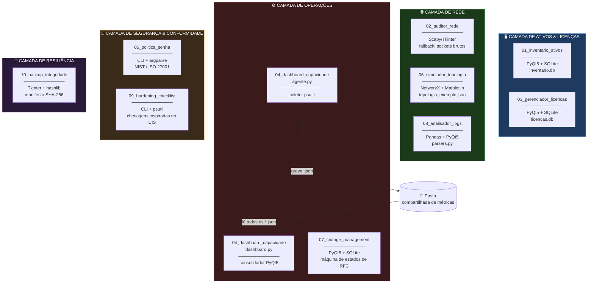
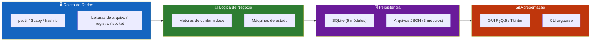
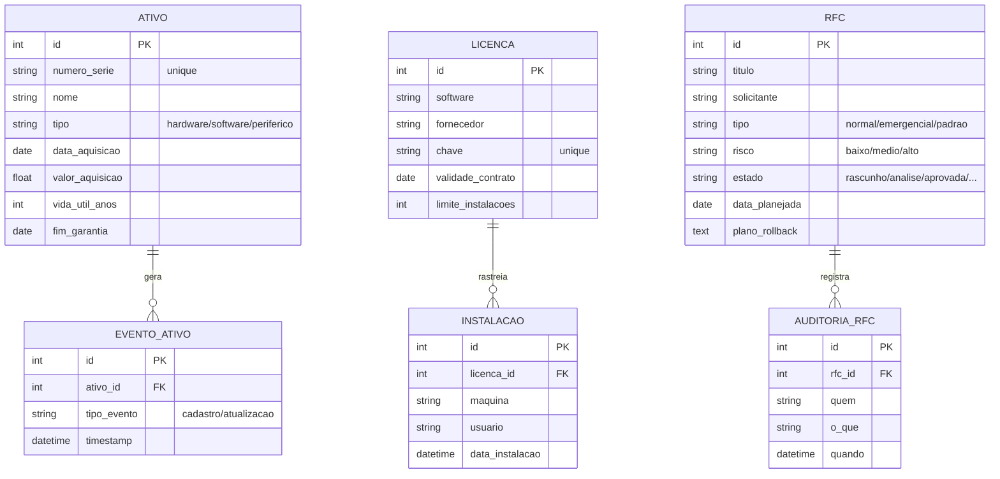
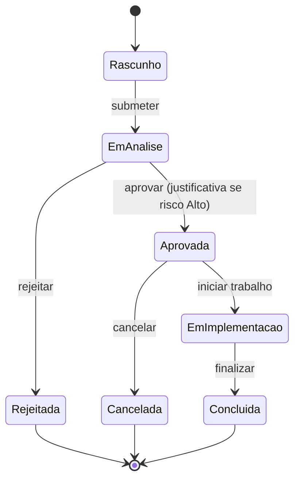
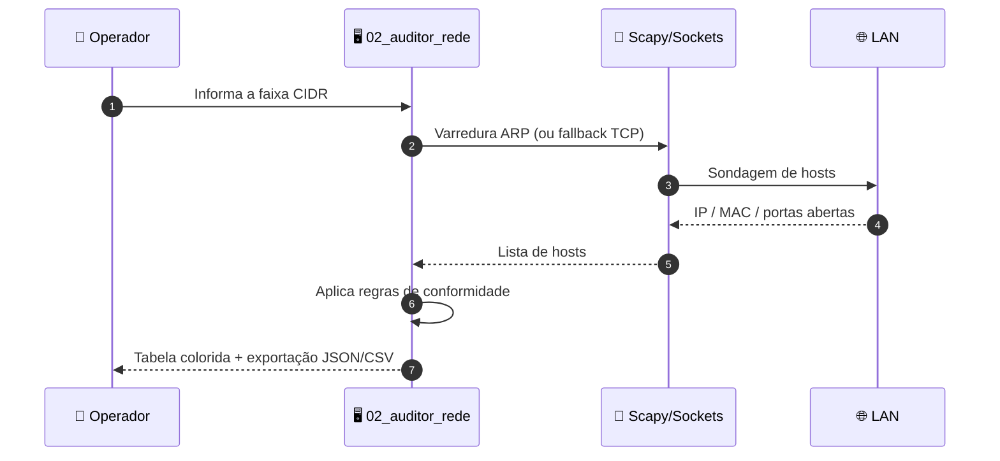
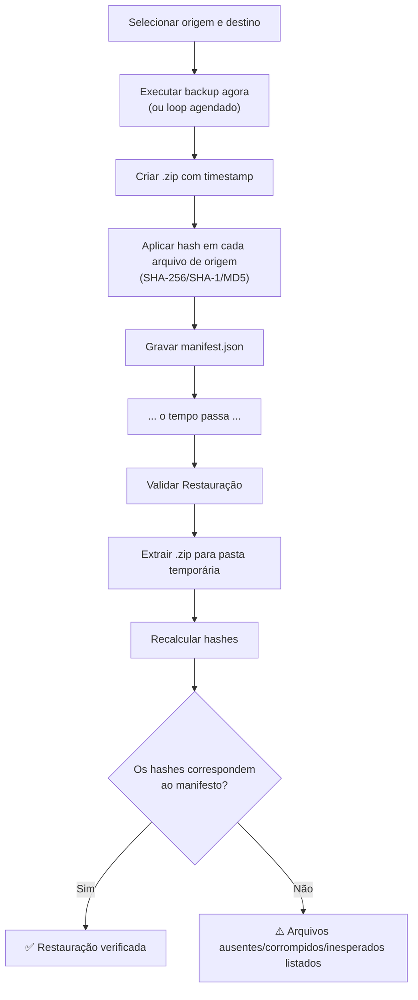
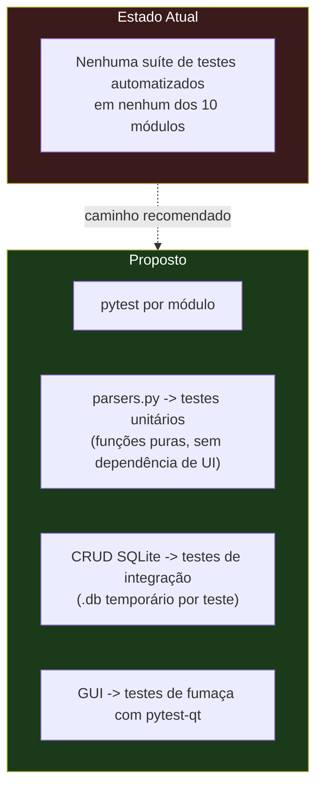

<div align="center">

**🌐 Choose Language / Selecione o Idioma / Elija el Idioma**

[](README.md)&nbsp;&nbsp;&nbsp;[](README_PT.md)&nbsp;&nbsp;&nbsp;[](README_ES.md)

</div>

---

<div align="center">

```
██╗███╗   ██╗███████╗██████╗  █████╗  ██████╗  ██████╗ ██╗   ██╗███████╗██████╗ ███╗   ██╗
██║████╗  ██║██╔════╝██╔══██╗██╔══██╗██╔════╝ ██╔═══██╗██║   ██║██╔════╝██╔══██╗████╗  ██║
██║██╔██╗ ██║█████╗  ██████╔╝███████║██║  ███╗██║   ██║██║   ██║█████╗  ██████╔╝██╔██╗ ██║
██║██║╚██╗██║██╔══╝  ██╔══██╗██╔══██║██║   ██║██║   ██║╚██╗ ██╔╝██╔══╝  ██╔══██╗██║╚██╗██║
██║██║ ╚████║██║     ██║  ██║██║  ██║╚██████╔╝╚██████╔╝ ╚████╔╝ ███████╗██║  ██║██║ ╚████║
╚═╝╚═╝  ╚═══╝╚═╝     ╚═╝  ╚═╝╚═╝  ╚═╝ ╚═════╝  ╚═════╝   ╚═══╝  ╚══════╝╚═╝  ╚═╝╚═╝  ╚═══╝
              10 Ferramentas Python Independentes para Governança Local de TI e Infraestrutura
```

---

[](https://www.python.org/)
[](https://pypi.org/project/PyQt5/)
[](https://www.sqlite.org/)
[](https://pandas.pydata.org/)
[](https://networkx.org/)
[]()
[]()

<br/>

> **Um monorepo com 10 ferramentas Python independentes e offline-first que juntas cobrem a superfície**
> operacional diária da governança local de TI, do inventário de ativos à integridade de backups.

<br/>


-41CD52?style=flat-square)

-10B981?style=flat-square)


</div>

---

## 📑 Índice

<details>
<summary>▶️ <strong>Clique para expandir / recolher esta seção</strong></summary>

<table>
<tr>
<td valign="top" width="50%">

**🏗️ Sistema**
- [Visão Geral](#-visão-geral)
- [Arquitetura do Sistema](#-arquitetura-do-sistema)
- [Stack Tecnológica](#-stack-tecnológica)
- [Padrões de Projeto](#-padrões-de-projeto-aplicados)
- [Estrutura do Projeto](#-estrutura-do-projeto)

**📦 Módulos**
- [01 Inventário de Ativos](#01--inventário-offline-de-ativos-de-ti)
- [02 Auditor de Rede](#02--auditor-de-configuração-de-rede-local)
- [03 Gerenciador de Licenças](#03--gerenciador-de-licenças-de-software)
- [04 Dashboard de Capacidade](#04--dashboard-de-capacidade-multi-máquina)
- [05 Política de Senha](#05--gerador-de-política-e-conformidade-de-senhas)
- [06 Simulador de Topologia](#06--simulador-de-topologia-de-rede)
- [07 Change Management](#07--gerenciador-de-mudanças-rfc)
- [08 Analisador de Logs](#08--analisador-de-logs-de-firewallproxy)
- [09 Checklist de Hardening](#09--checklist-de-hardening-cis-benchmark)
- [10 Integridade de Backup](#10--backup-local-com-verificação-de-integridade)

</td>
<td valign="top" width="50%">

**💼 Negócio**
- [Regras de Negócio](#-regras-de-negócio)
- [Requisitos Funcionais](#-requisitos-funcionais)
- [Requisitos Não Funcionais](#-requisitos-não-funcionais)

**📐 Design**
- [Modelo de Dados](#-modelo-de-dados)
- [Fluxos do Sistema](#-fluxos-do-sistema)

**🔐 Segurança & Operações**
- [Segurança](#-segurança)
- [Instalação & Execução](#-instalação--execução)
- [Testes Automatizados](#-testes-automatizados)
- [Métricas & Monitoramento](#-métricas--monitoramento)
- [Limitações Conhecidas](#-limitações-conhecidas)

</td>
</tr>
</table>

---

</details>

## 🌟 Visão Geral

<details>
<summary>▶️ <strong>Clique para expandir / recolher esta seção</strong></summary>

O **InfraGovernation** é um monorepo com **10 aplicações Python independentes e autocontidas**, cada uma vivendo em sua própria pasta numerada, com seu próprio `app.py` (ou ponto de entrada equivalente), seu próprio `requirements.txt` e seu próprio `README.md`. Não há runtime compartilhado, nenhum pacote compartilhado e nenhuma camada de orquestração entre as ferramentas: qualquer pasta pode ser copiada isoladamente e continuar funcionando.

O conjunto cobre as necessidades operacionais recorrentes de um departamento de TI pequeno ou médio que não opera uma plataforma completa de ITSM/CMDB: saber quais hardwares e softwares existem, auditar a rede local, acompanhar a conformidade de licenças, monitorar a capacidade de disco/memória entre máquinas, aplicar política de senhas, modelar a resiliência de rede, executar controle de mudanças com trilha de auditoria, triar logs de firewall, checar o hardening do sistema operacional contra controles inspirados no CIS e verificar se os backups realmente podem ser restaurados.

Toda ferramenta que precisa de persistência usa um **arquivo SQLite local** criado automaticamente na primeira execução, portanto nada no conjunto exige um servidor de banco de dados, um broker de mensagens ou qualquer outra peça de infraestrutura compartilhada. Duas ferramentas (`05_politica_senha` e `10_backup_integridade`) usam apenas a biblioteca padrão do Python.

### 🎯 Objetivos do Sistema

| Objetivo | Descrição |
|-----------|-------------|
| 🖥️ **Visibilidade de Ativos** | Manter um inventário pesquisável de hardware/software com depreciação linear automática |
| 🌐 **Conformidade de Rede** | Descobrir hosts da LAN e sinalizar portas abertas arriscadas (Telnet, FTP, SMB/RDP expostos) |
| 📜 **Controle de Licenças** | Rastrear chaves de licença, validade de contrato e limites de instalação por título de software |
| 📊 **Consciência de Capacidade** | Consolidar telemetria de CPU/memória/disco de múltiplas máquinas em um único painel |
| 🔑 **Conformidade de Senhas** | Validar a configuração de senhas contra os perfis NIST 800-63B e ISO/IEC 27001 |
| 🕸️ **Modelagem de Resiliência** | Simular falhas de nó/enlace em uma topologia de rede e calcular caminhos redundantes |
| 📝 **Controle de Mudanças** | Aplicar uma máquina de estados de RFC com trilha de auditoria imutável |
| 🔎 **Triagem de Logs** | Normalizar logs do Squid/pfSense/Firewall do Windows e sinalizar padrões de varredura/força bruta |
| 🛡️ **Hardening de SO** | Executar checagens inspiradas no CIS em Windows ou Linux com códigos de saída compatíveis com CI |
| 💾 **Garantia de Backup** | Verificar por hash que um backup comprimido pode ser restaurado sem corrupção |

---

</details>

## 🏗️ Arquitetura do Sistema

<details>
<summary>▶️ <strong>Clique para expandir / recolher esta seção</strong></summary>

### Diagrama de Módulos



### Camadas da Arquitetura



---

</details>

## 🛠️ Stack Tecnológica

<details>
<summary>▶️ <strong>Clique para expandir / recolher esta seção</strong></summary>

<table>
<tr><th>Camada</th><th>Tecnologia</th><th>Versão</th><th>Propósito</th></tr>
<tr><td rowspan="1">Linguagem</td><td>Python</td><td>3.9+</td><td>Runtime para os 10 módulos</td></tr>
<tr><td rowspan="4">GUI</td><td>PyQt5</td><td>&gt;=5.15</td><td>GUI dos módulos 01, 03, 04, 07, 08</td></tr>
<tr><td>Tkinter</td><td>stdlib</td><td>GUI dos módulos 02, 10</td></tr>
<tr><td>Matplotlib</td><td>&gt;=3.7</td><td>Canvas interativo de topologia no módulo 06</td></tr>
<tr><td>argparse</td><td>stdlib</td><td>CLI dos módulos 05, 09</td></tr>
<tr><td rowspan="2">Persistência</td><td>SQLite</td><td>stdlib (sqlite3)</td><td>BD local dos módulos 01, 03, 04 (via JSON), 07</td></tr>
<tr><td>Arquivos JSON</td><td>stdlib</td><td>Config/estado dos módulos 04, 06, 09, 10</td></tr>
<tr><td rowspan="3">Dados / Rede</td><td>Pandas</td><td>&gt;=2.0</td><td>Normalização de logs no módulo 08</td></tr>
<tr><td>NetworkX</td><td>&gt;=3.0</td><td>Algoritmos de grafos no módulo 06</td></tr>
<tr><td>Scapy</td><td>&gt;=2.5</td><td>Descoberta de hosts via ARP no módulo 02 (opcional)</td></tr>
<tr><td rowspan="1">Sistema</td><td>psutil</td><td>&gt;=5.9</td><td>Telemetria de CPU/memória/disco nos módulos 04, 09</td></tr>
<tr><td rowspan="1">Biblioteca Padrão</td><td>hashlib, zipfile, subprocess, re</td><td>stdlib</td><td>Hashing, compactação, checagens de SO, validação</td></tr>
</table>

---

</details>

## 🎨 Padrões de Projeto Aplicados

<details>
<summary>▶️ <strong>Clique para expandir / recolher esta seção</strong></summary>

| Padrão | Onde | Justificativa |
|---------|-------|-----------|
| **Estratégia de Fallback** | `02_auditor_rede/app.py` | Recua da varredura ARP via Scapy para sockets TCP brutos quando Npcap/privilégios de administrador estão ausentes |
| **Máquina de Estados** | `07_change_management/app.py` (`TRANSICOES_PERMITIDAS`) | Aplica as transições legais de RFC (Rascunho → Em Análise → Aprovada → ...) |
| **Strategy** | `08_analisador_logs/parsers.py` | Uma estratégia de parser por formato de log (Squid, pfSense, Firewall do Windows), todos normalizados para um único schema |
| **Produtor/Consumidor via Sistema de Arquivos** | `04_dashboard_capacidade` (`agente.py` / `dashboard.py`) | Os agentes gravam snapshots JSON; o dashboard os consome sem um protocolo de rede |
| **Template Method** | `09_hardening_checklist/app.py` | Fluxo comum de checagem-e-relatório especializado por conjunto de controles detectado por SO |
| **Motor de Regras** | `05_politica_senha/app.py`, `02_auditor_rede/app.py` | Regras de conformidade declarativas avaliadas contra uma configuração ou resultado de varredura |
| **Repository (implícito)** | `01_inventario_ativos`, `03_gerenciador_licencas`, `07_change_management` | Acesso ao SQLite isolado atrás de funções CRUD, separado das views PyQt5 |
| **Verificação de Manifesto/Checksum** | `10_backup_integridade/app.py` | Manifesto SHA-256/SHA-1/MD5 gerado no momento do backup, reproduzido na restauração |

---

</details>

## 📁 Estrutura do Projeto

<details>
<summary>▶️ <strong>Clique para expandir / recolher esta seção</strong></summary>

```
InfraGovernation/
│
├── 📂 01_inventario_ativos/         # Inventário offline de ativos de TI (PyQt5 + SQLite)
│   ├── 📄 app.py                    # GUI, CRUD, depreciação, alertas
│   ├── 📄 requirements.txt          # PyQt5>=5.15
│   └── 📄 README.md                 # Documentação do módulo (não alterada)
│
├── 📂 02_auditor_rede/              # Auditor de conformidade de rede local (Scapy/Tkinter)
│   ├── 📄 app.py                    # Descoberta, varredura de portas, regras de conformidade
│   ├── 📄 requirements.txt          # scapy>=2.5
│   └── 📄 README.md
│
├── 📂 03_gerenciador_licencas/      # Gerenciador de licenças de software (PyQt5 + SQLite)
│   ├── 📄 app.py                    # CRUD de licenças, limites de instalação, alertas
│   ├── 📄 requirements.txt          # PyQt5>=5.15
│   └── 📄 README.md
│
├── 📂 04_dashboard_capacidade/      # Dashboard de capacidade multi-máquina (PyQt5 + psutil)
│   ├── 📄 agente.py                 # Coletor por estação -> snapshot JSON
│   ├── 📄 dashboard.py              # Visualizador consolidador PyQt5
│   ├── 📂 metrics/                  # Pasta padrão de snapshots locais
│   ├── 📄 requirements.txt          # PyQt5>=5.15, psutil>=5.9
│   └── 📄 README.md
│
├── 📂 05_politica_senha/            # CLI de política e conformidade de senhas (apenas stdlib)
│   ├── 📄 app.py                    # gerar-exemplo / validar-config / validar-senha
│   ├── 📄 requirements.txt          # (sem dependências externas)
│   └── 📄 README.md
│
├── 📂 06_simulador_topologia/       # Simulador de topologia de rede (NetworkX + Matplotlib)
│   ├── 📄 app.py                    # Grafo interativo, simulação de falhas, caminhos redundantes
│   ├── 📄 requirements.txt          # networkx>=3.0, matplotlib>=3.7
│   └── 📄 README.md
│
├── 📂 07_change_management/         # Gerenciador de mudanças / RFC (PyQt5 + SQLite)
│   ├── 📄 app.py                    # Máquina de estados de RFC, trilha de auditoria
│   ├── 📄 requirements.txt          # PyQt5>=5.15
│   └── 📄 README.md
│
├── 📂 08_analisador_logs/           # Analisador de logs de firewall/proxy (Pandas + PyQt5)
│   ├── 📄 app.py                    # GUI, motor de correlação
│   ├── 📄 parsers.py                # Lógica de parsing pura por formato de log
│   ├── 📄 requirements.txt          # PyQt5>=5.15, pandas>=2.0
│   └── 📄 README.md
│
├── 📂 09_hardening_checklist/       # Checklist de hardening inspirado no CIS (CLI + psutil)
│   ├── 📄 app.py                    # Detecção de SO, conjunto de controles, relatório JSON
│   ├── 📄 requirements.txt          # psutil>=5.9
│   └── 📄 README.md
│
├── 📂 10_backup_integridade/        # Backup local com verificação de integridade (Tkinter + hashlib)
│   ├── 📄 app.py                    # Backup, manifesto, loop agendado, validação de restauração
│   ├── 📄 requirements.txt          # (sem dependências externas)
│   └── 📄 README.md
│
├── 📄 README.md                     # Este arquivo (inglês, primário)
├── 📄 README_PT.md                  # Tradução em português
└── 📄 README_ES.md                  # Tradução em espanhol
```

---

</details>

## 📦 Módulos do Sistema

<details>
<summary>▶️ <strong>Clique para expandir / recolher esta seção</strong></summary>

### 01 · Inventário Offline de Ativos de TI

`01_inventario_ativos/app.py` (407 linhas) é uma aplicação desktop PyQt5 apoiada em um arquivo SQLite local `inventario.db`, criado automaticamente na primeira execução.

| Responsabilidade | Detalhe |
|---|---|
| Cadastrar/editar/excluir ativos | Hardware, software, periféricos, licenças, equipamentos de rede |
| Unicidade | O número de série é obrigatoriamente único para evitar duplicatas |
| Depreciação | Depreciação linear automática a partir do valor de aquisição, data e vida útil |
| Aba de alertas | Ativos com garantia vencida ou vencendo em até 30 dias |
| Histórico | Log de eventos por ativo (cadastro, atualizações) |
| Busca/filtro | Por texto (nome, série, responsável) e por status |
| Exportação | CSV |

---

### 02 · Auditor de Configuração de Rede Local

`02_auditor_rede/app.py` (276 linhas) varre a LAN, identifica hosts (IP/MAC/hostname) e portas abertas, e produz um relatório de conformidade.

| Responsabilidade | Detalhe |
|---|---|
| Descoberta de hosts | Varredura por faixa CIDR; ARP via Scapy quando Npcap + privilégios de administrador estão disponíveis |
| Modo de fallback | Recuo automático para sockets TCP simples quando Scapy/privilégios não estão disponíveis |
| Varredura de portas | Lista configurável de portas comuns |
| DNS reverso | Resolução de hostname por host descoberto |
| Motor de conformidade | Sinaliza portas arriscadas (Telnet, FTP, SMB/RDP expostos) e ausência de DNS reverso |
| UI | Tabela Tkinter, verde = conforme, vermelho = não conforme |
| Exportação | JSON e CSV |

---

### 03 · Gerenciador de Licenças de Software

`03_gerenciador_licencas/app.py` (390 linhas) é uma aplicação PyQt5 apoiada em `licencas.db`, que rastreia chaves de licença e limites de instalação.

| Responsabilidade | Detalhe |
|---|---|
| Registro de licenças | Software, fornecedor, chave única, tipo, contrato, valor |
| Rastreamento de instalações | Por máquina/usuário, bloqueia automaticamente ao atingir o limite contratado |
| Aba de alertas | Licenças vencidas/vencendo em até 30 dias, ou no limite de instalações |
| Busca | Por software, fornecedor ou contrato |
| Exportação | CSV |

---

### 04 · Dashboard de Capacidade Multi-Máquina

Arquitetura de dois componentes em `04_dashboard_capacidade/`: `agente.py` (91 linhas) coleta telemetria via `psutil` em cada estação e grava um arquivo `<hostname>.json` em uma pasta compartilhada; `dashboard.py` (159 linhas) é um visualizador PyQt5 que lê todos os JSONs dessa pasta e os consolida em um único painel.

| Responsabilidade | Detalhe |
|---|---|
| Coleta | CPU, memória, swap e uso de disco por partição |
| Consolidação | Agregação multi-máquina baseada em arquivos, sem necessidade de banco central |
| Alertas | Disco >= 85% ou memória >= 90% |
| Detalhamento | Detalhe por partição ao clicar |
| Atualização | Automática a cada 30 segundos ou botão manual |
| Agendamento do agente | `--intervalo 0` para uma única execução de coleta (ex.: via Agendador de Tarefas do Windows) |

---

### 05 · Gerador de Política e Conformidade de Senhas

`05_politica_senha/app.py` (230 linhas) é uma CLI apenas com a biblioteca padrão que valida a configuração de senhas contra os perfis de referência **NIST SP 800-63B** e **ISO/IEC 27001**.

| Comando | Propósito |
|---|---|
| `gerar-exemplo --saida <arquivo>` | Gera um arquivo de configuração de exemplo conforme |
| `validar-config <arquivo> --perfil {nist,iso27001}` | Valida uma configuração exportada (ex.: de AD/GPO) |
| `validar-senha "<senha>" --perfil <perfil>` | Valida uma única senha |

Chaves de configuração verificadas: `tamanho_minimo`, `exige_maiuscula`, `exige_minuscula`, `exige_numero`, `exige_especial`, `expiracao_dias`, `bloqueia_reuso_ultimas`, `bloqueia_senhas_comuns`, `max_tentativas_login`.

---

### 06 · Simulador de Topologia de Rede

`06_simulador_topologia/app.py` (216 linhas) desenha uma topologia de rede (nós core/switch/servidor/WAN) usando NetworkX e Matplotlib, e simula falhas de forma interativa.

| Responsabilidade | Detalhe |
|---|---|
| Renderização | Codificada por cor conforme o tipo de nó |
| Simulação de falhas | Clicar em um nó ou no ponto médio de um enlace para removê-lo do grafo ativo |
| Caminho mais curto | Dijkstra/BFS via NetworkX entre origem/destino escolhidos |
| Caminhos redundantes | Contagem de caminhos disjuntos por aresta (`edge_disjoint_paths`) sob falhas simuladas |
| Persistência | Topologias customizadas carregáveis/salváveis como JSON `networkx.node_link_data` |
| Reset | Restaura a topologia original |

---

### 07 · Gerenciador de Mudanças (RFC)

`07_change_management/app.py` (418 linhas) é uma aplicação PyQt5 que implementa um fluxo interno de Request-for-Change com trilha de auditoria imutável.

```
Rascunho -> Em Análise -> Aprovada -> Em Implementação -> Concluída
              |               |
              v               v
          Rejeitada        Cancelada
```

| Responsabilidade | Detalhe |
|---|---|
| Formulário de RFC | Título, solicitante, tipo (normal/emergencial/padrão), risco, sistemas afetados, data planejada, plano de rollback obrigatório |
| Máquina de estados | Somente as transições definidas em `TRANSICOES_PERMITIDAS` são permitidas |
| Bloqueio de alto risco | Aprovar mudanças de risco Alto exige comentário/justificativa obrigatória |
| Restrição de edição | Edição direta do formulário permitida somente enquanto a RFC está em Rascunho |
| Restrição de exclusão | Exclusão permitida somente para RFCs em Rascunho ou Canceladas |
| Trilha de auditoria | Log completo de quem/quando/o quê por RFC, aba dedicada, nunca apagado |
| Exportação | CSV |

---

### 08 · Analisador de Logs de Firewall/Proxy

`08_analisador_logs/` separa o parsing (`parsers.py`, 145 linhas) da UI PyQt5 (`app.py`, 186 linhas), importando logs do **Squid**, **pfSense** e **Firewall do Windows**.

| Formato | Detalhe |
|---|---|
| Squid `access.log` | `timestamp client_ip status/code bytes method url user ...` |
| pfSense `filterlog` (CSV) | `timestamp, action, proto, src, src_port, dst, dst_port` |
| Firewall do Windows `pfirewall.log` (W3C) | `date time action protocol src-ip dst-ip src-port dst-port ...` |

| Aba | Detalhe |
|---|---|
| Eventos | Tabela navegável completa, filtro por origem/destino e permitir/negar |
| Anomalias Detectadas | 10+ conexões negadas de uma origem; 20+ destinos distintos de uma origem; 15+ portas de destino distintas de uma origem |
| Resumo Estatístico | Totais, permitidas vs. negadas, origens/destinos únicos |
| Exportação | Eventos filtrados para CSV |

---

### 09 · Checklist de Hardening (CIS Benchmark)

`09_hardening_checklist/app.py` (217 linhas) é uma CLI que executa um checklist de hardening de SO inspirado nos controles do CIS Benchmark, detectando automaticamente Windows ou Linux.

| Escopo | Controles |
|---|---|
| Multiplataforma | Nenhum serviço de alto risco (FTP/Telnet/SMB/RDP/VNC) escutando em portas expostas; revisão de sessões ativas; uso de disco do volume raiz/sistema abaixo de 90% |
| Windows | Firewall do Windows ativo em todos os perfis; comprimento mínimo de senha >= 8 (`net accounts`); SMBv1 desabilitado; estado do serviço WinRM (informativo) |
| Linux | SSH `PermitRootLogin no`; `PASS_MAX_DAYS` <= 90 em `/etc/login.defs`; firewall (`firewalld`/`ufw`) habilitado |

Código de saída: `0` = 100% conforme, `1` = pelo menos uma lacuna encontrada, tornando-o utilizável em CI/agendadores. `--saida relatorio.json` grava um relatório JSON.

---

### 10 · Backup Local com Verificação de Integridade

`10_backup_integridade/app.py` (323 linhas) é uma aplicação Tkinter apenas com a biblioteca padrão que agenda backups locais, aplica hash em cada arquivo e valida a restaurabilidade.

| Responsabilidade | Detalhe |
|---|---|
| Backup | Pasta de origem compactada em um `.zip` com timestamp no destino |
| Manifesto | `_hashes/<arquivo>.zip.manifest.json` com SHA-256/SHA-1/MD5 de cada arquivo original |
| Agendamento | Loop em segundo plano a cada N minutos (thread + sleep, sem dependências externas) |
| Validação de restauração | Extrai o `.zip` para uma pasta temporária, recalcula os hashes, compara com o manifesto, sinaliza arquivos ausentes/corrompidos/inesperados |
| Log | Log de operações em tempo real na UI |
| Persistência de configuração | Pastas de origem/destino salvas em `backup_config.json` |

---

</details>

## 💼 Regras de Negócio

<details>
<summary>▶️ <strong>Clique para expandir / recolher esta seção</strong></summary>

### Governança de Ativos & Licenças

| # | Regra | Aplicação |
|---|------|-------------|
| RN-01 | O número de série de um ativo deve ser único em todo o inventário | Validação de inserção em `01_inventario_ativos` contra `inventario.db` |
| RN-02 | A depreciação é calculada linearmente a partir do valor de aquisição, data e vida útil | Função de depreciação em `01_inventario_ativos` |
| RN-03 | Uma licença não pode ser instalada além do número de instalações contratado | Bloqueio por contagem de instalações em `03_gerenciador_licencas` |
| RN-04 | As chaves de licença devem ser únicas | Validação de inserção em `03_gerenciador_licencas` |

### Governança de Mudanças & Rede

| # | Regra | Aplicação |
|---|------|-------------|
| RN-05 | Uma RFC só pode transitar entre os estados definidos na tabela de transições | `TRANSICOES_PERMITIDAS` em `07_change_management` |
| RN-06 | Aprovar uma RFC de risco Alto exige um comentário de justificativa não vazio | Validação de aprovação em `07_change_management` |
| RN-07 | Uma RFC só pode ser excluída enquanto está em Rascunho ou Cancelada | Guarda de exclusão em `07_change_management` |
| RN-08 | Um host que expõe Telnet, FTP, SMB não autenticado ou RDP é sinalizado como não conforme | Motor de regras de conformidade em `02_auditor_rede` |

### Governança de Capacidade & Backup

| # | Regra | Aplicação |
|---|------|-------------|
| RN-09 | Uma máquina é sinalizada quando o uso de disco >= 85% ou o uso de memória >= 90% | Limiares de alerta em `04_dashboard_capacidade/dashboard.py` |
| RN-10 | Um backup restaurado só é considerado válido se o hash recalculado de cada arquivo corresponder à entrada do manifesto | Validação de restauração em `10_backup_integridade` |

---

</details>

## ✅ Requisitos Funcionais

<details>
<summary>▶️ <strong>Clique para expandir / recolher esta seção</strong></summary>

| ID | Requisito | Prioridade | Status |
|----|-------------|----------|--------|
| RF-01 | Cadastrar, editar e excluir ativos de TI com depreciação | 🔴 Alta | ✅ Implementado |
| RF-02 | Alertar sobre garantia de ativo vencida/vencendo | 🟡 Média | ✅ Implementado |
| RF-03 | Exportar inventário de ativos para CSV | 🟢 Baixa | ✅ Implementado |
| RF-04 | Descobrir hosts da LAN por faixa CIDR | 🔴 Alta | ✅ Implementado |
| RF-05 | Varrer lista configurável de portas por host | 🔴 Alta | ✅ Implementado |
| RF-06 | Recuar para descoberta baseada em socket sem privilégios de administrador | 🟡 Média | ✅ Implementado |
| RF-07 | Cadastrar licenças de software com contrato e valor | 🔴 Alta | ✅ Implementado |
| RF-08 | Bloquear instalações além do número de licenças contratado | 🔴 Alta | ✅ Implementado |
| RF-09 | Coletar telemetria de CPU/memória/disco por estação | 🔴 Alta | ✅ Implementado |
| RF-10 | Consolidar telemetria multi-máquina em um único painel | 🔴 Alta | ✅ Implementado |
| RF-11 | Validar configuração de senha contra perfis NIST/ISO | 🔴 Alta | ✅ Implementado |
| RF-12 | Validar uma única senha contra um perfil | 🟡 Média | ✅ Implementado |
| RF-13 | Simular falha de nó/enlace em uma topologia | 🟡 Média | ✅ Implementado |
| RF-14 | Calcular caminhos mais curtos e redundantes | 🟡 Média | ✅ Implementado |
| RF-15 | Aplicar as transições da máquina de estados de RFC | 🔴 Alta | ✅ Implementado |
| RF-16 | Manter uma trilha de auditoria imutável por RFC | 🔴 Alta | ✅ Implementado |
| RF-17 | Analisar logs do Squid/pfSense/Firewall do Windows em um único schema | 🔴 Alta | ✅ Implementado |
| RF-18 | Detectar padrões de varredura/força bruta em logs normalizados | 🟡 Média | ✅ Implementado |
| RF-19 | Executar checagens de hardening cientes do SO com relatório | 🔴 Alta | ✅ Implementado |
| RF-20 | Retornar códigos de saída compatíveis com CI a partir das checagens de hardening | 🟡 Média | ✅ Implementado |
| RF-21 | Compactar e gerar manifesto de hash de um backup | 🔴 Alta | ✅ Implementado |
| RF-22 | Validar a restaurabilidade do backup contra o manifesto | 🔴 Alta | ✅ Implementado |
| RF-23 | Agendar backups recorrentes sem dependências externas | 🟡 Média | ✅ Implementado |
| RF-24 | Console central de log para operações de backup | 🟢 Baixa | ✅ Implementado |
| RF-25 | Persistir configuração de pastas de origem/destino entre execuções | 🟢 Baixa | ✅ Implementado |

---

</details>

## ⚡ Requisitos Não Funcionais

<details>
<summary>▶️ <strong>Clique para expandir / recolher esta seção</strong></summary>

| ID | Categoria | Requisito | Alvo |
|----|----------|-------------|--------|
| RNF-01 | ⚡ Desempenho | Operações locais em SQLite respondem sem atraso perceptível na UI | < 200ms por consulta |
| RNF-02 | 🔌 Portabilidade | Cada módulo executa de sua própria pasta apenas com seu próprio `requirements.txt` | Nenhum código compartilhado |
| RNF-03 | 🖥️ Multiplataforma | O módulo 09 detecta o SO e adapta os controles automaticamente | Windows + Linux |
| RNF-04 | 🔐 Menor Privilégio | A auditoria de rede degrada graciosamente sem admin/Npcap | Fallback funcional |
| RNF-05 | 💾 Durabilidade de Dados | Arquivos SQLite são criados e persistidos localmente, nunca em memória | Sobrevive a reinício do processo |
| RNF-06 | 📦 Pegada de Dependências | Dois módulos (05, 10) não exigem pacotes de terceiros | Apenas stdlib |
| RNF-07 | 🧩 Modularidade | Cada ferramenta é implantável e removível de forma independente | Sem imports cruzados |
| RNF-08 | ♻️ Auditabilidade | O histórico de change management nunca é apagado, mesmo ao remover uma RFC | Linhas de log imutáveis |
| RNF-09 | 🖼️ Usabilidade | As ferramentas com GUI fornecem feedback de status codificado por cor | Indicadores visuais verde/vermelho |
| RNF-10 | 🧪 Testabilidade | A lógica de parsing é separada da UI quando viável | Isolamento de `parsers.py` |
| RNF-11 | 🔁 Automatizabilidade | O checklist de hardening retorna códigos de saída de processo padrão | Compatível com CI/agendadores |
| RNF-12 | 📁 Simplicidade Operacional | Nenhum projeto exige um servidor de banco de dados em execução | Apenas SQLite/JSON |
| RNF-13 | 🌐 Tolerância de Rede | O dashboard de capacidade funciona com uma pasta local no lugar de um compartilhamento de rede | Mesmo caminho de código |

---

</details>

## 🗄️ Modelo de Dados

<details>
<summary>▶️ <strong>Clique para expandir / recolher esta seção</strong></summary>

### Diagrama Entidade-Relacionamento

Cada módulo apoiado em SQLite possui seu próprio schema; não há banco de dados compartilhado. O diagrama abaixo modela a união das entidades persistidas entre os módulos 01, 03 e 07.



### Estado Não Relacional (módulos baseados em JSON/arquivo)

| Módulo | Armazenamento | Formato |
|---|---|---|
| `04_dashboard_capacidade` | `<hostname>.json` por estação | `{cpu, memoria, swap, discos: [{particao, uso_pct}], timestamp}` |
| `06_simulador_topologia` | `topologia_exemplo.json` | Grafo `networkx.node_link_data` (nós com `tipo`, arestas) |
| `09_hardening_checklist` | `relatorio.json` (opcional) | `{checks: [{nome, status, recomendacao}], conforme_pct}` |
| `10_backup_integridade` | `_hashes/<arquivo>.zip.manifest.json`, `backup_config.json` | Manifesto `{arquivo: sha256}`; configuração `{origem, destino, intervalo}` |

---

</details>

## 🔄 Fluxos do Sistema

<details>
<summary>▶️ <strong>Clique para expandir / recolher esta seção</strong></summary>

### Fluxo de Aprovação de RFC



### Sequência de Auditoria de Rede



### Validação de Backup & Restauração



---

</details>

## 🔐 Segurança

<details>
<summary>▶️ <strong>Clique para expandir / recolher esta seção</strong></summary>

### Controles Implementados

| Controle | Implementação | Efeito |
|---|---|---|
| Varredura de rede com menor privilégio | Modo de fallback de `02_auditor_rede` | Funciona sem admin/Npcap, apenas com menor precisão |
| Validação de política de senhas | Motores NIST/ISO de `05_politica_senha` | Sinaliza tamanho fraco, reuso, complexidade, configurações de expiração |
| Trilha de auditoria imutável | `AUDITORIA_RFC` em `07_change_management` | Nenhum caminho de exclusão exposto para linhas de auditoria |
| Bloqueio de aprovação de alto risco | `07_change_management` | Exige comentário de justificativa antes da aprovação |
| Checagens de hardening de SO | `09_hardening_checklist` | Sinaliza Telnet/FTP/SMBv1/RDP exposto, login root fraco via SSH |
| Verificação de integridade de backup | `10_backup_integridade` | Detecta corrupção silenciosa via comparação de hash |
| Dados somente locais | Todos os módulos | Nenhum dado sai da máquina, exceto exportações explícitas em CSV/JSON |

### Limitações Conhecidas de Segurança

> [!WARNING]
> Estas ferramentas são auxílios educacionais/operacionais, não um produto de segurança endurecido. Revise as limitações abaixo antes de utilizá-las como evidência de conformidade.

| Limitação | Risco | Caminho de Mitigação |
|---|---|---|
| Arquivos SQLite não são criptografados em disco | Exposição de dados locais se a máquina for comprometida | Adicionar criptografia de disco no nível do SO (BitLocker/LUKS) |
| Nenhuma camada de autenticação/autorização em qualquer GUI | Qualquer usuário local pode visualizar/editar todos os registros | Envolver com permissões de arquivo do SO ou adicionar uma camada de autenticação |
| A varredura de fallback de `02_auditor_rede` é menos precisa | Falsos negativos na descoberta de hosts/portas | Preferir o caminho Scapy+Npcap quando possível |
| Os controles do checklist de hardening são um subconjunto do CIS Benchmark completo | Cobertura de conformidade apenas parcial | Tratar como uma primeira passada, combinar com uma varredura CIS completa |
| Sem criptografia de transporte de rede para a pasta compartilhada do `04_dashboard_capacidade` | JSON de snapshot legível por qualquer um com acesso ao compartilhamento | Restringir ACLs do compartilhamento às máquinas autorizadas |
| O validador de senha verifica apenas configuração/formato, não bancos de vazamentos | Senhas comuns mas tecnicamente válidas podem passar | Combinar com uma checagem de senha vazada (ex.: API HIBP) |

---

</details>

## 🚀 Instalação & Execução

<details>
<summary>▶️ <strong>Clique para expandir / recolher esta seção</strong></summary>

### Pré-requisitos

```bash
# Python 3.9 ou mais recente, ambiente virtual por módulo recomendado
python --version
```

### Build

Não há etapa de build; cada módulo é Python puro. Instale apenas o que um dado módulo precisa:

```bash
# Exemplo: módulo 01 (Inventário de Ativos)
cd 01_inventario_ativos
pip install -r requirements.txt
```

### Execução

```bash
# Padrão genérico para cada módulo
cd <pasta_do_módulo>
pip install -r requirements.txt
python app.py            # ou o ponto de entrada nomeado no README daquele módulo

# O módulo 04 precisa dos dois processos:
python agente.py --pasta "\\servidor\compartilhamento\metrics" --intervalo 60
python dashboard.py

# Os módulos 05 e 09 são CLIs:
python app.py gerar-exemplo --saida config_exemplo.json
python app.py --saida relatorio.json
```

### Scripts & Alvos

| Módulo | Ponto de Entrada | Flags Especiais |
|---|---|---|
| 01 | `app.py` | nenhuma |
| 02 | `app.py` | requer Npcap no Windows para precisão total |
| 03 | `app.py` | nenhuma |
| 04 | `agente.py`, `dashboard.py` | `--pasta`, `--intervalo` |
| 05 | `app.py` | `gerar-exemplo`, `validar-config`, `validar-senha` |
| 06 | `app.py` | argumento opcional `<topologia.json>` |
| 07 | `app.py` | nenhuma |
| 08 | `app.py` | nenhuma |
| 09 | `app.py` | `--saida relatorio.json` |
| 10 | `app.py` | nenhuma |

### Configuração de Build/Runtime

| Configuração | Onde | Propósito |
|---|---|---|
| `PyQt5>=5.15` | requirements.txt de 01/03/04/07/08 | Fixação do toolkit de GUI |
| `scapy>=2.5` | requirements.txt de 02 | Varredura ARP; opcional em runtime |
| `pandas>=2.0` | requirements.txt de 08 | Processamento de dataframe de logs |
| `networkx>=3.0`, `matplotlib>=3.7` | requirements.txt de 06 | Modelagem e renderização de grafos |
| `psutil>=5.9` | requirements.txt de 04, 09 | Telemetria do sistema |

---

</details>

## 🧪 Testes Automatizados

<details>
<summary>▶️ <strong>Clique para expandir / recolher esta seção</strong></summary>

### Arquitetura de Testes



Nenhum dos 10 módulos possui atualmente um arquivo de teste automatizado. Essa é uma lacuna real, declarada abertamente em vez de escondida.

### Executando os Testes

```bash
# Ainda não existe suíte de testes. Para validar um módulo manualmente:
cd 08_analisador_logs
python -c "from parsers import parse_squid; print(parse_squid('access.log'))"
```

### Checklist Manual de Aceitação

| # | Checagem | Módulo | Resultado Esperado |
|---|---|---|---|
| 1 | Cadastrar um ativo com número de série duplicado | 01 | Rejeitado com erro |
| 2 | Varrer `127.0.0.0/30` sem privilégios de administrador | 02 | Recua para modo socket, ainda retorna resultados |
| 3 | Instalar uma licença além do limite | 03 | Bloqueado |
| 4 | Apontar agente e dashboard para a mesma pasta local | 04 | Dashboard exibe o snapshot coletado |
| 5 | Validar uma senha de 6 caracteres contra o NIST | 05 | Reportada como não conforme |
| 6 | Clicar em um nó na visualização de topologia | 06 | Nó removido, caminho recalculado |
| 7 | Aprovar uma RFC de risco Alto sem comentário | 07 | Bloqueado com mensagem de validação |
| 8 | Importar um log do Squid e um do pfSense juntos | 08 | Ambos normalizados em uma única tabela de eventos |
| 9 | Executar o checklist em uma máquina protegida vs. padrão | 09 | Percentuais de conformidade diferentes, códigos de saída 0 vs 1 |
| 10 | Corromper um arquivo dentro de um backup restaurado | 10 | Sinalizado como divergência de hash |

---

</details>

## 📊 Métricas & Monitoramento

<details>
<summary>▶️ <strong>Clique para expandir / recolher esta seção</strong></summary>

### Métricas do Código

| Módulo | Arquivo(s) de entrada | Linhas |
|---|---|---|
| 01 | app.py | 407 |
| 02 | app.py | 276 |
| 03 | app.py | 390 |
| 04 | agente.py + dashboard.py | 91 + 159 |
| 05 | app.py | 230 |
| 06 | app.py | 216 |
| 07 | app.py | 418 |
| 08 | app.py + parsers.py | 186 + 145 |
| 09 | app.py | 217 |
| 10 | app.py | 323 |
| **Total** | | **~3.058** |

### Sinais de Runtime

| Sinal | Fonte | Significado |
|---|---|---|
| Tamanho do arquivo SQLite | `inventario.db`, `licencas.db`, BD de RFC | Cresce com os registros; incluir no backup junto com a aplicação |
| Atualidade do `<hostname>.json` | Pasta compartilhada de `04_dashboard_capacidade` | Timestamp desatualizado indica que um agente parou de coletar |
| `conforme_pct` do `relatorio.json` | `09_hardening_checklist` | Acompanhar a tendência ao longo do tempo por máquina |
| Contagem de manifestos de backup | `10_backup_integridade/_hashes/` | Um manifesto esperado por execução de backup bem-sucedida |

### Comandos de Diagnóstico

```bash
# Contar linhas por módulo rapidamente
wc -l 01_inventario_ativos/app.py 02_auditor_rede/app.py 03_gerenciador_licencas/app.py

# Inspecionar um arquivo SQLite sem GUI
sqlite3 01_inventario_ativos/inventario.db ".tables"

# Checar o código de saída do hardening em um script
python 09_hardening_checklist/app.py; echo "exit=$?"
```

### Códigos de Saída / Status

| Código | Módulo | Significado |
|---|---|---|
| 0 | 09_hardening_checklist | 100% dos controles aplicáveis passam |
| 1 | 09_hardening_checklist | Pelo menos uma lacuna de controle encontrada |
| N/A | Módulos com GUI (01, 02, 03, 04, 07, 08, 10) | Nenhum contrato de código de saída de processo; erros exibidos via diálogos |

---

</details>

## ⚠️ Limitações Conhecidas

<details>
<summary>▶️ <strong>Clique para expandir / recolher esta seção</strong></summary>

> [!IMPORTANT]
> Estas são ferramentas educacionais/operacionais independentes, não uma suíte ITSM integrada. Trate as limitações de cada módulo separadamente.

| Categoria | Problema | Status |
|---|---|---|
| Testes | Não existe suíte de testes automatizados em nenhum módulo | ⚠️ Aberto |
| Integração | Os módulos não compartilham banco de dados, API ou configuração comum | ➕ Intencional |
| Concorrência | Os módulos SQLite assumem uso local com escritor único | ⚠️ Aberto |
| Segurança | Nenhuma camada de autenticação em qualquer ferramenta com GUI | ⚠️ Aberto |
| Precisão | O modo de fallback de `02_auditor_rede` é menos preciso que o caminho via Scapy | ⚠️ Aberto |
| Cobertura | O `09_hardening_checklist` implementa um subconjunto, não o CIS Benchmark completo | ⚠️ Aberto |
| Rede | O `04_dashboard_capacidade` exige uma pasta compartilhada configurada manualmente | ➕ Intencional |
| Escala | Não projetado para frotas além de um departamento de TI pequeno/médio | ➕ Intencional |
| Persistência | Nenhum relatório entre módulos ou dashboard unificado | ⚠️ Aberto |
| Compatibilidade | Os módulos com GUI exigem uma sessão desktop (sem modo headless) | ⚠️ Aberto |

> [!TIP]
> A melhoria de maior valor seria adicionar uma suíte `pytest` começando pelo `08_analisador_logs/parsers.py`, já que suas funções de parsing já são puras e independentes de UI, tornando-as as mais baratas de cobrir primeiro.

---

</details>

---

<div align="center">

---

### 🏛️ InfraGovernation

*Dez pequenas ferramentas, uma infraestrutura governada.*


<br/>

```
"Governança não é uma plataforma que se compra. É a soma das pequenas
 verificações que você faz antes que algo quebre."
```

</div>
